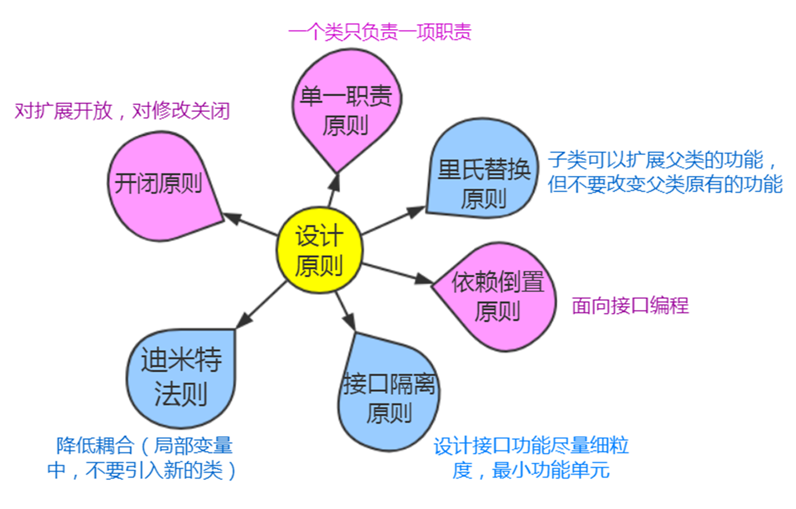
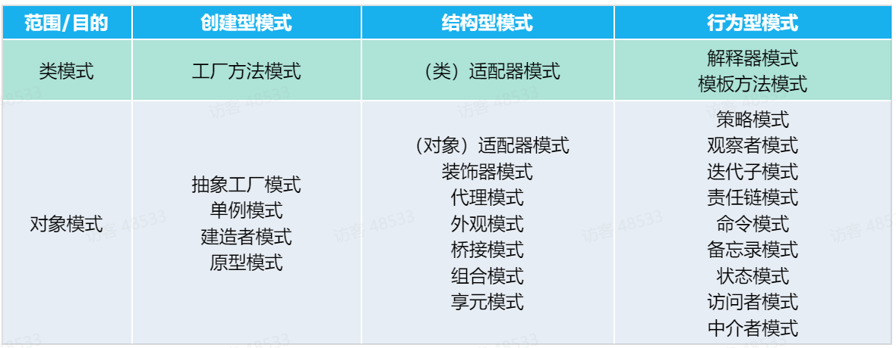
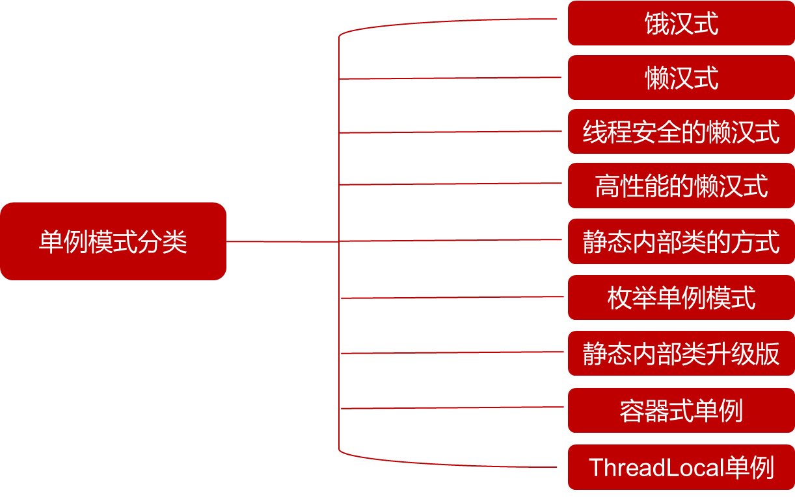

# Java设计模式学习笔记

## 一、六大设计原则

### （一） 单一职责原则（类、方法、接口）
定义：
单一职责原则（Single Responsibility Principle，SRP）又称单一功能原则。这里的职责是指类变化的原因，单一职责原则规定一个类应该有且仅有一个引起它变化的原因，否则类应该被拆分（There should never be more than one reason for a class to change）。
该原则提出对象不应该承担太多职责，如果一个对象承担了太多的职责，至少存在以下两个缺点：
1. 一个职责的变化可能会削弱或者抑制这个类实现其他职责的能力；
2. 当客户端需要该对象的某一个职责时，不得不将其他不需要的职责全都包含进来，从而造成冗余代码或代码的浪费。
   优点：
   单一职责原则的核心就是控制类的粒度大小、将对象解耦、提高其内聚性。如果遵循单一职责原则将有以下优点：
1. 降低类的复杂度。一个类只负责一项职责，其逻辑肯定要比负责多项职责简单得多。
2. 提高类的可读性。复杂性降低，自然其可读性会提高。
3. 提高系统的可维护性。可读性提高，那自然更容易维护了。
4. 变更引起的风险降低。变更是必然的，如果单一职责原则遵守得好，当修改一个功能时，可以显著降低对其他功能的影响。

1.1.2 里氏替换原则
定义：所有引用积累的地方必须能透明地使用其子类的对象。
通俗讲，只要父类能出现的地方子类就可以出现，而且替换为子类也不会产生任何错误或者异常，使用者可能根本就不需要知道是父类还是子类。但是反过来就不行了，有子类出现的地方，父类未必就能适应。
里氏替换原则为良好的继承定义了一个规范，一句简单的定义包含了4层含义：
1. 子类必须完全实现父类方法
2. 子类可以有自己的个性
3. 覆盖或实现父类的方法使输入参数可以被放大
4. 覆写或实现父类的方法时输出结果可以被缩小

1.1.3 依赖倒置原则
依赖倒置原则（dependence inversion principle）包含三层含义：
1. 高层模块不应该依赖底层模块，两者都应该依赖其抽象
2. 抽象不应该依赖细节
3. 细节应该依赖抽象
   依赖倒置原则在java中需要遵循以下规则：
1. 每个类尽量都有接口或抽象类，或者抽象类和接口两者都具备：这是依赖倒置的基本要求，接口和抽象类都是属于抽象类的，有了抽象才可能依赖倒置。
2. 变量的表面类型尽量是接口或者抽象类：并不是变量的类型一定要是接口或者抽象类，比如一个工具类，xxxutils一般是不需要接口或是抽象类。还有，如果使用类clone方法，就必须使用实现类，这个是JDK提供的一个规范。
3. 任何类都不应该从具体类派生：如果一个项目处于开发状态，确实不应该有从具体类派生出子类的情况，但人总会犯错，因此不超出两层的继承都是可以忍受的。
4. 尽量不要覆写基类的方法：如果基类是一个抽象类，而且这个方法已经实现了，子类尽量不要覆写。类间依赖的是抽象，覆写了抽象方法，对依赖的稳定性会产生一定的影响。
5. 综合里氏替换原则使用。
   依赖倒置原则是6个设计原则中最难以实现的原则，它是实现开闭原则的重要途径。依赖倒原则没有实现，就别想实现对拓展开放，对修改关闭。在项目中，大家只要记住是“面向接口编程”就基本上抓住了依赖倒置原则的核心。

1.1.4 接口隔离原则
接口隔离原则要求接口的纯洁性，接口隔离原则时对接口进行规范约束，包含4层含义：
1. 接口要尽量小：这是几口隔离原则的核心定义，不出现臃肿的接口（fat interface），但是“小”是有限度的，首先就是不能违反单一职责原则。
2. 接口要高内聚：就是提高接口，类、模块的处理能力，减少对外的交互。
3. 定制服务：单独为一个个体提供优良的服务。我们在做系统设计时也需要考虑对系统之间或模块之间的接口采用定制服务。采用定制服务就必然有一个要求：只提供访问者需要的方法。
4. 接口设计时有限度的：接口的设计粒度越小，系统越灵活，这是不争的事实。但是，灵活的同时也带来了结构的复杂化，开发难度增加。可维护性降低，这不是一个项目或产品所期望看到的，所以接口设计一定要注意适度。

1.1.5 迪米特法则
定义：
迪米特法则（law of demeter,LoD）也成为最少知识原则（least knowledge principle），虽然名字不同，但描述的是同一个规则：一个对象应该对其他对象有最少的了解。通俗地讲，一个类应该对自己需要耦合或调用的类知道得最少，你（被耦合或调用的类）的内部是如何复杂都和我没有关系，那是你的事情，我就知道提供的这么多public方法，我就调用这么多，其他的我一概不关心。
迪米特法则的核心观念就是类间解耦，弱耦合，只有弱耦合了以后，类的复用率才可以提高。其要求的结果就是产生了大量的中转和跳转类，导致系统的复杂性提高，同时也为维护带来了难度。需要反复权衡，既做到结构清晰，又做到高内聚低耦合。

1.1.6 开闭原则
定义：
一个软件实体如类、模块和函数应该对扩展开放，对修改关闭。
开闭原则的的重要性：
1. 开闭原则对测试的影响：测试时出错，测试失败时。通过扩展来实现业务逻辑的变化，而不是修改；
2. 开闭原则可以提高服用性：在面向对象的设计中，所有的逻辑都是从原子逻辑组合而来的，而不是在一个类中独立实现一个业务逻辑。只有这样的代码才可以复用，粒度越小，被复用的可能性越大。
3. 开闭原则可以提高可维护性
   如何使用开闭原则？
   抽象约束：抽象是对一组事物的通用描述，没有具体的实现，也就表示它可以有非常多的可能性，可以跟随需求的变化而变化。因此通过接口或抽象类可以约束一组可能变化的行为，并且能够实现对扩展开放，包含三层含义：第一，通过接口或抽象类约束扩展，对扩展进行辩解限定，不允许出现在接口或抽象类中不存在的public方法；第二，参数类型、引用对象尽量使用接口或者抽象类，而不是实现类；第三，抽象层尽量保持稳定，一旦确定即不允许修改。
   元数据（metadata）控制模块行为：编程是一个很苦很累的活，那怎么才能减轻我们的压力呢？答案是尽量使用元数据来控制程序的行为，减少重复开发。什么是元数据：用来描述环境和数据的数据，通俗地说就是配置参数，参数可以从文件中获得，也可以从数据库中获得。
   制定项目章程：在一个团队中，建立项目章程是非常重要的，因为章程中制定了所有人员都必须遵守的约定，对项目来说，约定优于配置。
   封装变化：对变化的封装包含两层含义：第一，将相同的变化封装到一个接口或抽象类中，第二，将不同的变化封装到不同的接口或抽象类中，不应该有两个不同的变化出现在同一个接口或抽象类中，封装变化也就是受保护的变化（protected variations）,找出预计有变化或不稳定的点，我们为这些变化点创建稳定的接口，准确的讲是粉状可能的变化。

1.2 23种设计模式（上）

1.2.1 设计模式的分类
根据其目的：
即模式是用来做什么的，可分为创建型(Creational)，结构型(Structural)和行为型(Behavioral)三种：
1. 创建型模式主要用于创建对象。
2. 结构型模式主要用于处理类或对象的组合。
3. 行为型模式主要用于描述对类或对象怎样交互和怎样分配职责。
   根据范围：
   即模式主要是用于处理类之间关系还是处理对象之间的关系，可分为类模式和对象模式两种：
1. 类模式处理类和子类之间的关系，这些关系通过继承建立，在编译时刻就被确定下来，是属于静态的。
2. 对象模式处理对象间的关系，这些关系在运行时刻变化，更具动态性。

暂时无法在飞书文档外展示此内容
1.2.2 工厂模式
简单工厂：
只有唯一工厂（简单工厂），一个产品接口/抽象类，根据简单工厂中的静态方法来创建具体产品对象。适用于产品较少，几乎不扩展的情景。
工厂方法：
有多个工厂（抽象工厂+多个具体工厂），一个产品接口/抽象类，根据继承抽象工厂中的方法来多态创建具体产品对象。适用于一个类型的多个产品。
抽象方法：
有多个工厂（抽象工厂+多个具体工厂），多个产品接口/抽象类，对产品子类进行分组，根据继承抽象工厂中的方法多态创建同组的不同具体产品对象。适用于多个类型的多个产品。

1.2.3 简单工厂模式
优点：
简单工厂可以使客户端免除直接创建对象的职责，能够根据需要创建出对应的产品。实现客户端和产品类代码分离。此外可以通过配置文件来实现不修改客户端代码的情况下添加新的具体产品类（改进）。
缺点：
违背开闭原则，如果需要新增其他产品类，就必须在工厂类中新增if-else逻辑判断（可以通过配置文件来改进）。但是整体来说，系统扩展还是相对其他工厂模式要困难。
[图片]
1.2.4 工厂方法模式
[图片]
1. 为了弥补这种扩展性。在工厂方法模式中，将工厂方法抽象出来，成单独接口。
2. 工厂类结构与产品类结构一一对应，每一种产品都对应一个工厂子类。
3. 当新增一个产品类型时，新加对应的工厂子类即可，不再需要修改既有类。
   跟静态工厂模式比，工厂类膨胀太多，需要根据需求取舍

1.2.5 抽象工厂模式
[图片]
不同水果有不同包装规格，客户下单时，自动配出包装
-----生产苹果时：配置纸箱包装
-----生产香蕉时：配置竹箩包装
保证客户端始终只使用同一个产品族中的对象

1.2.6 建造者模式
例如：创建一个促销套餐的业务流程
[图片]
1. 所有套餐都有这四个步骤。
2. 套餐会不断增加丰富。
3. 订单在结算套餐时，算法与具体套餐无关。
4. 会员套餐与假日套餐的配置，交给专业人员（老员工）来做。
   场景：水果店推出水果套餐，老顾客优惠10元，节假日套餐优惠15元
   [图片]

1.2.7 建造者模式与工厂方法模式异同
[图片]

1.1.8 工厂模式总结
[图片]

原则：
1. 解耦：把对象的创建和使用的过程分开。
2. 工厂负责对象的创建，包括其init方法的调用，黑盒创建过程。
3. 面向接口编程： 使用者只管使用，只知其接口而不知其实现类。
   对比：
4. 静态工厂：把所有对象的创建逻辑集中到一个（专业）类里处理
5. 工厂方法模式：一个工厂负责创建一个产品类的创建
6. 将一个系列的产品的工厂合并成一个工厂，负责生产这个系列的产品
7. 对象的创建比较复杂时，按步骤一块块创建，让创建过程模板化。

1.1.9 单例模式
定义：
某个类只能有一个实例，提供一个全局的访问点。
单例模式的3个要点：
某个类只能有一个实例；
它必须自行创建这个实例；
它必须自行向整个系统提供这个实例
优点：
可以节省内存，因为它限制了实例的个数，有利于Java垃圾回收（garbage collection），而且确保所有对象都访问唯一实例。
注意事项：不适用于变化的对象，如果同一类型的对象总是要在不同的用例场景发生变化，单例就会引起数据的错误，不能保存彼此的状态。用单例模式，就是在适用其优点的状态下使用

