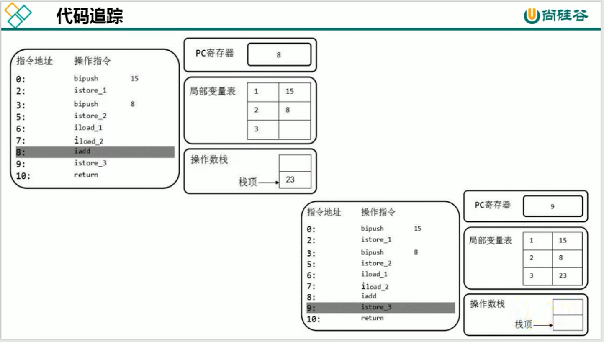
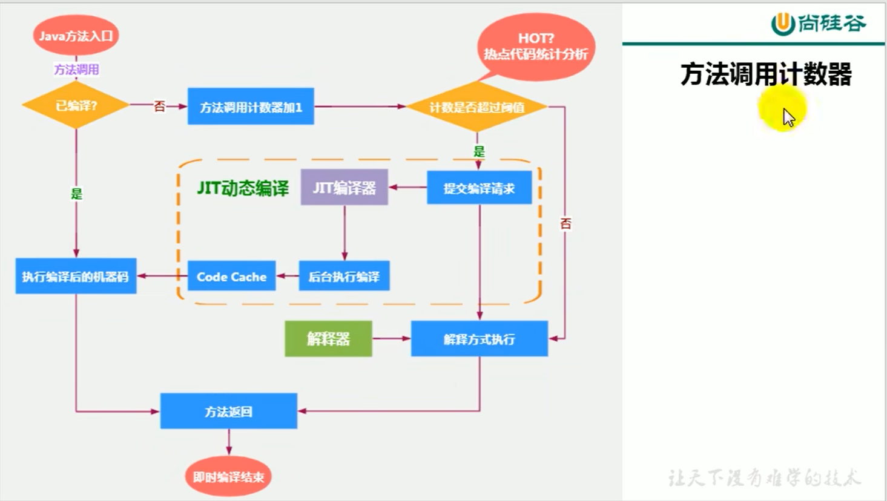

# jvm学习笔记

## 一、类的加载


#### 双亲委派机制


## 二、运行时数据区
### <font color='blue'>（一）程序计数器（Program Counter Register）</font>

    作用：用来存储只想下一条指令的地址，将要执行的指令代码，有执行引擎读取下一条指令

    · 它是一块很小的内存空间，几乎可以忽略不计，也是运行速度最快的存储区域
    · 在jvm规范中，每个线程都有它自己的程序计数器，是线程私有的，生命周期与线程保持一致
    · 任何时间一个线程都只有一个方法在执行，也就是所谓的当前方法，程序计数器会存储当前线程正在执行的java方法的jvm指令地址。如果是在执行native方法，则是未指定值(undefined)
    · 他是程序控制流的指示器，分支、循环、跳转、异常处理、线程恢复、等基础功能都需要依赖程序计数器来完成
    · 字节码解释器工作时就是通过改变这个计数器的值来选取下一个要执行的字节码指令
    · 他是唯一一个在java虚拟机规范中没有规定任何OutOfMemoryError情况的区域

#### 常见问题

>(1) 使用pc寄存器存储字节码指令地址有什么用，为什么记录当前现成的执行地址？
> 
>  答：因为CPU需要不停的切换线程，切换回来后需要知道从哪里开始继续执行，JVM字节码解释器需要通过改变PC寄存器的值来确定下一条该执行什么字节码指令

>(2) pc寄存器为什么被设定为线程私有？
>
>  答：我们都知道所谓的多线程在一个特定的时间段内只会执行其中某一个线程的方法，CPU会不停地做任务切换，这样必然导致经常中断或恢复，如何保证分毫无差呢?为了能够准确地记录各个线程正在执行的当前字节码指令地址，最好的办法自然是为每一个线程都分配一个PC寄存器，这样一来各个线程之间便可以进行独立计算，从而不会出现相互干扰的情况。
>
>由于CPU时间片轮限制，众多线程在并发执行过程中，任何一个确定的时刻，一个处理器或者多核处理器中的一个内核，只会执行某个线程中的一条指令。
>
>这样必然导致经常中断或恢复，如何保证分毫无差呢?每个线程在创建后，都会产生自己的程序计数器和栈帧，程序计数器在各个线程之间互不影响。

### <font color='blue'>（二）java虚拟机栈</font>


#### 1. 局部变量表（local variables）


#### 2. 操作数栈/表达式栈（operand stack）


```java
public class Test {
    public void testJvm() {
        byte i = 15;
        int j = 8;
        int k = i + j;
    }
}
```


##### 栈顶缓存技术


#### 3. 动态链接


> 为什么需要常量池？
> 为了提供一些符号和常量，便于指令的识别

#### 4. 方法返回地址


### <font color='blue'>（三）本地方法栈</font>


### <font color='blue'>（四）堆</font>


```java
public class HeapSpaceInitial {
    public static void main(String[] args) {
//        返回ava虚越机中的堆内存总量
        long initialMemory = Runtime.getRuntime().totalMemory() / 1024 / 1024;
//        返回Java虚拟机试图使用的最大雄内存量
        long maxMemory = Runtime.getRuntime().maxMemory() / 1024 / 1024;
        
        System.out.println("-Xms :" + initialMemory + "m");
        System.out.println("-Xmx : " + maxMemory + "m");
        System.out.println("系统内存大小为: " + initialMemory * 64 / 1024 + "G");
        System.out.printIn("系统内存大小为: " + maxMemory * 4 / 1024 + "G");
    }
}
```

> 查看java进程的堆内存分配使用情况
>```shell
>jstat -gc ${pid}
>```

> 堆空间的参数设置
> <a href="https://docs.oracle.com/javase/8/docs/technotes/tools/unix/java.html">官网说明</a>
> -XX:+PrintFlagsInitial -> 查看所有的参数的默认初始值
> -XX:+PrintFlagsFinal :查看所有的参数的最终值 (可能会存在修改不再是初始值)
> -Xms:初始堆空间内存 -> (默认为物理内存的1/64)
> -Xmx:最大堆空间内存(默认为物理内存的1/4) 
> -Xmn:设置新生代的大小。(初始值及最大值)
> -XX:NewRatio:2 -> 配置新生代与老年代在堆结构的占比


> 默认情况下，新生代老年代的比例是1:2;
> 新生代中Eden区、Survivor1、Survivor2分配的内存比例是8:1:1 //实际上压根不是8:1:1，加上参数```-XX:-UseAdaptiveSizePolicy``` 不适用自适应策略，一样还是不管用

>几乎所有的java对象都是在Eden区被new出来的，除非对象大道Eden区放不下

>绝大多数的java对象的销毁都是在新生代进行的    


### （五）垃圾回收（Garbage Collection）

```properties
//打印GC日志：
-XX:+PrintGCDetails
```


#### （1） 新生代GC触发机制
> 当新生代空间不足时，就会触发Minor GC ， 这里的新生代指的是Eden区满，Survivor区满不会触发Minor GC

> 因为java对象大多都具备朝生夕灭的特性，所以Minor GC 非常频繁，一般回收速度也比较快

> Minor GC 会触发STW，暂停其他用户的线程，等垃圾回收结束，用户线程才恢复运行

#### （2） 老年代GC触发机制
> 出现了Major GC，经常会伴随至少一次的Minor GC，但并非绝对，在Parallel Scavenge收集器的收集策略里就有直接进行Major GC的策略选择过程
>   也就是在老年代空间不足时，会先尝试触发Minor GC，如果之后空间还不足，则触发Major GC

> Major GC 的速度一般会比Minor GC慢10倍以上，STW的时间更长

> 如果Major GC后，内存还不足，就报OOM了

#### （3） Full GC 触发机制
> 触发Full GC 执行的情况有如下5种：
>   ① 调用```javaSystem.gc()``` 时，系统建议执行Full GC，但是不必然执行
>   ② 老年代空间不足
>   ③ 方法区空间不足
>   ④ 通过Minor GC 后进入老年代的平均大小大于老年代的可用内存
>   ⑤ 有Eden区、survivor space 0 （From Space）向 survivor space 1 （To Space）区复制时，对象大小大于To Space可用内存，则把该对象转存老年代，且老年代的可用内存小于该对象大小

> Full GC 是开发或调优种尽量要避免的，这样暂停时间会短一些

#### （4） 堆空间分代收集思想
> 分代的唯一理由就是优化GC性能

#### （5） 内存分配策略
> 如果对象在Eden出生并经过第一次Minor GC 后仍然存活，并且能被Survivor容纳的话，将被移动到Survivor空间中，并将对象年龄设为1，
> 对象晋升老年代的年龄阈值，可通过vm option ```-XX:MaxTenruingThreshold```来设置

> ① 优先分配到Eden
> ② 大对象（Eden放不下）直接分配到老年代 ==> 尽量避免程序中出现过多的大对象
> ③ 长期存活（年龄大于阈值，默认15）的对象分配到老年代
> ④ 动态对象年龄判断，如果Survivor区中相同年龄的所有对象大小总和大于Survivor空间的一半，年龄 >= 该年龄的对象可以直接进入老年代，无需等到MaxTenuringThreshold中要求的年龄
> ⑤ 空间分配担保

#### （6） 对象分配过程：TLAB (Thread Local Allocation Buffer)
> 堆区是线程共享区域，任何线程都可以访问堆区中的共享数据
> 由于对象实例的创建在JVM中非常频繁，因此在并发环境下从堆区中划分内存空间是线程不安全的
> 为避免多个线程操作同一地址，需要使用加锁等机制，进而影响分配速度

> 什么是TLAB？从内存模型而不是垃圾收集的角度，对Eden区域进行划分，JVM为每个线程分配了一个私有缓存区域，
> 多线程同时分配内存时，使用TLAB可以避免一系列的非线程安全问题，同时还能够提升内存分配的吞吐量，因此我们可以将这种内存分配方式称之为快速分配策略
> 所有OpenJDK衍生出来的JVM都提供了TLAB的设计

> 尽管不是所有对象实例都能在TLAB中成功分配内存，但JVM确实是将TLAB作为内存分配的首选
> 开发中，可以通过```-XX:UseTLAB``` 设置是否开启TLAB空间
> 默认情况下，TLAB空间内存非常小，<font color='red'>仅占整个Eden区的1%</font>，也可以通过```-XX:TLABWasteTargetPercent``` 设置TLAB空间所占Eden空间的百分比大小
> 一旦对象在tlab空间分配内存失败，JVM就会尝试通过<font color='red'>使用加锁机制</font>确保数据操作的原子性，从而直接在Eden空间中分配内存


### （六） 堆空间的常见参数设置

### （七） 内存分配担保策略
> 在发生Minor GC之前，虚拟机会检查老年代最大可用的连续空间是否大于新生代所有对象的总空间
>   - 如果大于，则此次Minor GC是安全的
>   - 如果小于，则虚拟机会查看 ```-XX:HandlePromotionFailure``` 设置值是否允许担保失败
>     - 如果为true，则继续检查老年代最大可用连续空间是否大于历次晋升到老年代的对象的平均大小
>       - 如果大于，则尝试进行一次Minor GC，但这次Minor GC 依然有风险
>       - 如果小于，则改为进行一次Full GC
> 
> 在 JDK6 Update24之后，HandlePromotionFailure参数不会再影响到虚拟机的内存分配担保策略，观察OpenJDK中的源码变化，虽然源码中还定义了HandlePromotionFailure参数，但是再代码中已经不会使用它
>  JDK6 Update24之后的规则变为只要老年代的连续空间大于新生代对象总大小 或者 历次晋升的平均大小就会进行Minor GC，否则将进行Full GC

### （八）逃逸分析：代码优化
> 当一个对象在方法中被定义后，对象只在方法内部使用，则认为没有发生逃逸
> 如果他被外部方法所引用，则认为发生逃逸，例如作为调用参数传递到其他方法中

- **栈上分配**：将堆分配转化为栈分配。如果一个对象在子程序中被分配，要使指向该对象的指针永远不会逃逸，对象可能是栈分配的候选，而不是堆分配
- **同步省略（消除）**：如果一个对象被发现只能从一个线程被访问到，那么对于这个对象的操作可以不考虑线程同步，也叫<font color='red'>锁消除</font>
  - 线程同步的代价是相当高的，
  - 在JIT编译阶段会被优化掉，字节码文件中不会优化
- **分离对象或标量替换**：有的对象可能不需要作为一个连续的内存结构存在也可以被访问到，那么对象的部分（或全部）可以不存储在内存，而是存储在CPU寄存器中
  - <font color='red'>标量（Scalar）</font> 是指一个无法再分解成更小的数据的数据，java中原始数据类型就是标量
  - 相对的，可以分解的数据叫做<font color='red'>聚合量（Aggregate）</font>，java中 对象 就是聚合量
  ```java
    private static void alloc() {
        Pont point = new Point(1, 2);
        System.out.println("point.x = " + point.getX() + "；point.y = " + point.getY());
    }
  ```
  > point对象并没有发生逃逸，因此经过jit编译器的优化后，就被替换成两个聚合量，好处是可以大大减少堆内存的占用
  ```java
    private static void alloc() {
        int x = 1;
        int y = 2;
        System.out.println("point.x = " + x + "；point.y = " + y);
    }
  ```
  > 标量替换参数设置：```-XX:+EliminateAllocations``` （默认为开启）

> 逃逸分析的论文于1999年就已经发表，但直到 JDK 1.6 才有实现，而且这项技术到如今也并不是十分成熟
> 其根本原因就是无法保证逃逸分析的性能消耗一定能高于他的消耗，
> 极端情况下，经过逃逸分析之后发现没有一个对象是不逃逸的
> Oracle Hotspot JVM 中，并未栈上分配没有逃逸的对象，因此可以明确<font color='red'>对象实例都是分配在堆上</font>

### <font color='blue'>（九）方法区</font>
#### 1.方法区的基本理解
> 《Java虚拟机规范》中明确说明：“尽管所有的方法区在逻辑上是属于堆的一部分，但一些简单的实现可能不会选择去进行垃圾回收或者压缩
> 但对于HotSpotJVM而言，方法区还有一个别名较多Non-Heap（非堆），目的就是要与堆分开
> 因此，方法区可以看作是一块儿独立于Java堆的内存空间
- 方法区（Method Area）与Java堆一样，是各个<font color='red'>线程共享</font>的内存区域
- 方法区在JVM启动的时候被创建，并且他的实际物理内存空间中和Java堆区一样都是可以<font color='red'>不连续的</font>
- 方法区的大小跟堆空间一样，可以选择固定大小或可扩展
- 方法区的大小决定了系统可以保存多少个类，如果定义太多的类，导致方法区移除，虚拟机会抛出内存溢出错误： 
  ```java.lang.OutOfMemoryError: PermGen space``` 或者 ```java.lang.OutOfMemoryError: Metaspace```
- 关闭JVM会释放这个区域的内存
- JDK7及以前，习惯上把方法区称为<font color='red'>永久代</font>，JDK8开始，使用<font color='red'>元空间</font>取代永久代
  - 本质上，方法区和永久代并不等价，仅是对HotSpot而言的，对如何实现方法区并不统一要求，例如：BEA JRockit / IBM J9 中不存在永久代的概念
  - 现在来看，当年使用永久代并不是好的idea，导致Java程序更容易出现OOM（超过```-XX:MaxPermSize```上限）
- 到了JDK8，终于完全废弃了永久代的概念，改用与JRockit、J9一样在本地内存中实现的元空间（Metaspace）来代替
- 本质上 元空间和永久代类似，都是对JVM规范中方法区的实现，不过元空间与永久代最大的区别在于：<font color='red'>元空间不在虚拟机设置设置的内存中，而是使用本地内存</font>
- 永久代、元空间 不只是名字变了，内部结构也有所调整
- 根据《Java虚拟机规范》的规定，如果方法区无法满足新的内存分配需求时，将抛出OOM异常
- 方法区的大小不必是固定的，jvm可根据应用需要动态调整
  - JDK7及以前，
    - 可通过```-XX:PermSize```来设置永久代初始分配空间，默认值是20.75M
    - ```-XX:MaxPermSize```来设置永久代最大可分配空间，32位机器默认为64M，64位机器默认是82M
    - 当JVM加在的类信息容量超过了这个值，会报异常 ```OutOfMemoryError:PermGen space```
  - JDK8及以后，
    - 元空间大小可以通过参数```-XX:MetaspaceSize```和```-XX:MaxMetaspaceSize``` 来设置
    - 默认值依赖于平台，windows下，```-XX:MetaspaceSize```默认为21M，```-XX:MaxMetaspaceSize```默认为-1，即没有限制
    - 与永久代不同，如果不指定大小，默认情况下，虚拟机会耗尽所有可用系统内存，如果元数据区发成溢出，一样会抛出异常```OutOfMemoryError: Metaspace```
    - 对于一个64位的服务器端JVM来说，```-XX:MetaspaceSize```默认为21M，这就是初始的<font color='red'>高水位线</font>，一旦触及水位线，Full GC将会被触发并卸载没用的类（即这些类对应的类加载器不再存活）然后这个高水位线将会重置，新的高水位线的值取决于GC后释放了多少元空间，如果释放的空间不足，那么在不超过MaxMetaspacesize时，适当提高该值。如果释放空间过多，则适当降低该值。
    - 如果初始化的高水位线设置过低，上述高水位线调整情况会发生很多次。通过垃圾回收器的日志可以观察到Ful1 GC多次调用。为了避免频繁地GC ，建议将-XX:MetaspaceSize设置为一个相对较高的值。


  ```java
  public class OOMTest extends classLoader {
      public static void main(String[] args) {
          int i = 0;
          try {
              OOMTest test = new OMTest();
              for (int i = o; i < 1000; i++) {
                  //创建CLasswriter对象，用于生成类的二进制字节码
                  ClassWriter classWriter=new Classwriter(0);
                  //指明版本号，修饰符，类名，包名，父类，接口
                  classwriter,visit(Opcodes.V1_8, Opcodes, ACC_PUBLIC, "class" + i, null, "java/lang/Object", null);
                  //返回byte[]byte[]
                  code=classwriter.toByteArray();
                  //类的加载
                  test.defineclass("class"+i, code, 0 ,code.length);
                  //class对象
                  j++;
              }
          } finally {
              System.out.println(j);
          }
      }
  }
  ```

#### 2.方法区的内部结构
> 《深入理解Java虚拟机》书中对方法区（Method Area）存储内容描述如下：
> 它用于存储已被虚拟机加载的类型信息、常量、静态变量、即时编译器（JIT）编译后的代码缓存等。
##### (1) 类型信息
> 对每个加载的类型（class, interface, enum, annotation），JVM必须在方法区存储以下类型信息：
> ① 完整有效名称（全名 = 包名，类名）
> ② 直接父类的完整有效名（对于interface或者java.lang.Object，都没有父类）
> ③ 修饰符（public, abstract, final的某个子集）
> ④ 实现的直接接口的一个有序列表

##### (2) 域（field）信息
> ① 名称
> ② 类型
> ③ 修饰符

##### (3) 方法（method）信息
> ① 方法名称
> ② 方法的返回类型（或void）
> ③ 方法参数的数量和类型（有序）
> ④ 方法修饰符
> ⑤ 方法的字节码（bytecodes）、操作数栈、局部变量表及大小（abstract和native方法除外）
> ⑥ 异常表（abstract和native方法除外）
>   - 每个异常处理的开始位置、结束位置、代码处理在程序计数器中的偏移地址、被补货的异常类的常量池索引

> 补充说明：全局常量（static final）在编译时就被分配了

##### (4) 运行时常量池
> 方法区常量池 VS 字节码常量池
> 方法区，内部包含了<font color='red'>运行时常量池</font>
> 字节码文件，内部包含了<font color='red'>常量池</font>
> 要弄清楚方法区，需要理解清楚classFile，因为加载类的信息都在方法区要弄清楚方法区的运行时常量池，需要理解清楚classFile中的常量池。
> https://docs.oracle.com/javase/specs/jvms/se8/html/jvms-4.html

###### ① 为什么要用常量池？
> 一个java源文件中的类、接口，编译后产生一个字节码文件。而Java中的字节码需要数据支持，通常这种数据会很大以至于不能直接存到字节码里，换另一种方式，可以存到常量池这个字节码包含了指向常量池的引用。在动态链接的时候会用到运行时常量池，之前有介绍
> 虽然只有194字节，但是里面却使用了string、System、PrintStream及Object等结构。这里代码量其实已经很小了。如果代码多，引用到的结构会更多!这里就需要常量池了!

###### ② 常量池里有什么？
- 数量值
- 字符串值
- 类引用
- 字段引用
- 方法引用

> 小结：常量池可以看做是一张表，虚拟机指令根据这张常量表找到要执行的类名、方法名、参数类型、字面量等类型

###### ③ 运行时常量池

- 运行时常量池(Runtime constant Pool) 是方法区的一部分。常量池表 (Constant Pool Table) 是class文件的一部分，用于存放编译期生成的各种字面量与符号引用，这部分内容将在类加载后存放到方法区的运行时常量池中。
- 运行时常量池，在加载类和接口到虚拟机后，就会创建对应的运行时常量池。
- JVM为每个已加载的类型 (类或接口) 都维护一个常量池。池中的数据项像数组项一样，是通过索引访问的。
- 运行时常量池中包含多种不同的常量，包括编译期就已经明确的数值字面量，也包括到运行期解析后才能够获得的方法或者字段引用。此时不再是常量池中的符号地址了，这里换为真实地址。
  - 运行时常量池，相对于class文件常量池的另一重要特征是: 具备动态性
  ```java
  String.intern();
  ```
- 运行时常量池类似于传统编程语言中的符号表(symbol table)，但是它所包含的数据却比符号表要更加丰富一些。
- 当创建类或接口的运行时常量池时，如果构造运行时常量池所需的内存空间超过了方法区所能提供的最大值，则JVM会抛OutOfMemoryError异常。

##### (5) 方法区的演进
> 2008年，Oracle公司收购EBA JRocket VM 
> 2014年，JDK8发布


> 为永久代设置空间大小是很难确定的
> 对永久代进行调优是很困难的

- **StringTable为什么要调整到堆空间？**
- jdk7中将stringTable放到了堆空间中。因为永久代的回收效率很低，在full gc的时候才会触发。而full gc是老年代的空间不足、永久代不足时才会触发这就导致stringTable回收效率不高。
- 而我们开发中会有大量的字符串被创建，回收效率低，导致永久代内存不足。放到堆里，能及时回收内存。
##### (6) 方法区的垃圾收集
> 有些人认为方法区(如HotSpot虚拟机中的元空间或者永久代) 是没有垃圾收集行为的，其实不然。《Java虚拟机规范》对方法区的约束是非常宽松的，提到过可以不要求虚拟机在方法区中实现垃圾收集。
> 事实上也确实有未实现或未能完整实现方法区类型卸载的收集器存在(如JDK 11时期的ZGC收集器就不支持类卸载)。 
> 一般来说这个区域的回收效果比较难令人满意，尤其是类型的卸载，条件相当苛刻。但是这部分区域的回收有时又确实是必要的。
> 以前Sun公司的Bug列表中，曾出现过的若干个严重的Bug就是由于低版本的HotSpot虚拟机对此区域未完全回收而导致内存泄漏。
> 方法区的垃圾收集主要回收两部分内容：**常量池中废弃的常量** 和 **不再使用的类型**
---
> 先来说说方法区内常量池之中主要存放的两大类常量: 字面量和符号引用。
> 字面量比较接近Java语言层次的常量概念，如文本字符串、被声明为final的常量值等。而符号引用则属于编译原理方面的概念，包括下面三类常量:
> - 1、类和接口的全限定名
> - 2、字段的名称和描述符
> - 3、方法的名称和描述符
> Hotspot虚拟机对常量池的回收策略是很明确的，只要常量池中的常量没有被任何地方引用，就可以被回收。
> 回收废弃常量与回收Java堆中的对象非常类似。
---
> 判定一个常量是否“废弃”还是相对简单，而要判定一个类型是否属于“不再被使用的类”的条件就比较苛刻了。需要同时满足下面三个条件:
> - 该类所有的实例都已经被回收，也就是Java堆中不存在该类及其任何派生子类的实例。
> - 加载该类的类加载器已经被回收，这个条件除非是经过精心设计的可替换类加载器的场景，如OSGi、JSP的重加载等，否则通常是很难达成的。
> - 该类对应的java.lang.class对象没有在任何地方被引用，无法在任何地方通过反射访问该类的方法。 
>
> Java虚拟机被允许对满足上述三个条件的无用类进行回收，这里说的仅仅是“被允许“，而并不是和对象一样，没有引用了就必然会回收。
> 关于是否要对类型进行回收HotSpot虚拟机提供了-Xnoclassgc参数进行控制，还可以使用-verbose:class以及-XX:+TraceClass-Loading、-XX:+TraceClassUnLoading查看类加载和卸载信息
> 
>在大量使用反射、动态代理、CGLib等字节码框架，动态生成JSP以及OSG这类频繁自定义类加载器的场景中，通常都需要Java虚拟机具备类型卸载的能力，以保证不会对方法区造成过大的内存压力。

### （三） 常见面试题
> <font color='red'>百度</font>
> 三面:说一下JVM内存模型吧，有哪些区?分别干什么的?
> <font color='red'>蚂蚁金服:</font>
> Java8的内存分代改进
> JVM 内存分哪几个区，每个区的作用是什么?
> 一面:JVM内存分布/内存结构?和堆的区别?堆的结构?为什么两个survivor区?
> 二面:Eden和Survior的比例分配
> <font color='red'>小米:</font>
> jvm内存分区，为什么要有新生代和老年代
> <font color='red'>字节跳动:</font>
> 二面: Java的内存分区
> 二面:讲讲ivm运行时数据库区
> 什么时候对象会进入老年代?
> <font color='red'>京东:</font>
> JVM的内存结构，Eden和survivor比例。
> JVM内存为什么要分成新生代，老年代，持久代。新生代中为什么要分为Eden和survivor
> <font color='red'>天猫:</font>
> 一面:Jvm内存模型以及分区，需要详细到每个区放什么。
> 一面:JVM的内存模型，Java8做了什么修改
> <font color='red'>拼多多:</font>
> JVM 内存分哪几个区，每个区的作用是什么?
> <font color='red'>美团:</font>
> java内存分配
> jvm的永久代中会发生垃圾回收吗?
> 一面:jvm内存分区，为什么要有新生代和老年代?

## 三、对象实例化
### （一）创建对象的方式
- new
- Class的newInstance0: 反射的方式，只能调用空参的构造器，权限必须是public
- Constructor的newInstance(Xxx): 反射的方式，可以调用空参、带参的构造器，权限没有要求
- 使用clone0: 不调用任何构造器，当前类需要实现Cloneable接口，实现clone0
- 使用反序列化:从文件中、从网络中获取一个对象的二进制流
- 第三方库Objenesis

### （二）创建对象的步骤
1. 判断对象对应的类是否加载、链接、初始化
2. 为对象分配内存
   - 如果内存规整 —— 指针碰撞
   - 如果内存不规整
     - 虚拟机需要维护一个列表
     - 空闲列表分配
   - 说明
3. 处理并发安全问题
   - 采用CAS配上失败重试保证更新的原子性
   - 每个线程预先分配一块TLAB
4. 初始化分配到的空间 —— 所有属性设置默认值，保证对象实例字段在不赋值时可以直接使用
5. 设置对象的对象头
6. 执行init方法进行初始化

### （三）对象的内存布局
#### 1.对象头
对象头包括两部分：
##### (1) 运行时元数据（Mark Word）
- 哈希值（HashCode）
- GC分代年龄
- 锁状态标志
- 线程持有的锁
- 偏向线程ID
- 偏向时间戳
##### (2) 类型指针
> 指向类元数据instance klass，确定该对象所属的类型
#### 2.实例数据
> 它是对象真正存储的有效信息，包括程序代码中定义的各种类型的字段（包括父类继承下来的）

> - 相同宽度的字段总是被分配在一起
> - 父类中定义的变量会出现在子类之前
> - 如果CompactFields参数为true（默认为true），子类的窄变量可能插入到父类变量的空隙
#### 3.对齐填充
> 不是必须的，占位的作用
#### 4.


## 四、直接内存
- 不是虚拟机运行时数据区的一部分，也不是《Java虚拟机规范》中定义的内存区域
- 直接内存是在Java堆外的、直接向系统申请的内存区间
- 来源于NIO，通过存在堆中的DirectByteBuffer操作Native内存
- 通常，访问直接内存的速度会优于Java堆，即读写性能高
  - 因此处于性能考虑，读写频率的场合可能会考虑使用直接内存
  - Java的NIO库允许Java程序使用直接内存，用于数据缓存区

## 五、执行引擎

### （一）概述
- 执行引擎是Java虚拟机核心的组成部分之一
- 虚拟机是相对于物理机而言，这两种机器都有代码执行能力，其区别是物理机的执行引擎是直接建立在处理器、缓存、指令集和操作系统层面上的
- 而虚拟机的执行引擎是由软件自行实现的，因此可以部首物理条件制约地定制指令集与执行引擎的结构体系，能够执行那些不被硬件直接支持的指令集格式

> JVM的主要任务是负责<font color='red'>装载字节码到其内部</font>，但字节码并不能够直接运行在操作系统之上，因为字节码指令并非等价于本地机器指令，他内部包含的仅仅只是一些能够被JVM所识别的字节码指令、符号表、以及其他辅助信息
> 那么如果想要让一个Java程序运行起来，执行引擎（Execution Engine）的任务就是<font color='red'>将字节码指令解释/编译为对应平台上的本地机器指令才可以</font>。简单来说，JVM中的执行引擎充当了高级语言翻译为机器语言的译者


#### 1. 什么是解释器（Interpreter）？
  解释器：当Java虚拟机启动时会根据预定义的规范对字节码采用逐行解释的方式执行，将每条字节码文件中的内容“翻译”为对应平台的本地机器指令执行

#### 2. 什么是JIT编译器（Just In Time Compiler）？
  编译器：就是虚拟机将源代码直接编译成和本地机器平台相关的机器语言

#### 3. 为什么说Java是半编译半解释型语言？
  JDK1.0时代，将Java语言定位为“解释执行”还是比较准确的，再后来Java也发展出可以直接生成本地代码的编译器
  现在JVM在执行Java代码的时候，通常会将解释执行与编译执行二者结合起来进行


#### 4. HotSpot VM中已经内置了JIT编译器，为什么还要再使用解释器？
> 当程序启动后，解释器可以马上发挥作用，省去编译的时间，立即执行编译器要想发挥作用，把代码编译成本地代码，需要一定的执行时间。但编译为本地代码后，执行效率高。
> 所以：尽管JRockit VM（不包含解释器）中程序的执行性能会非常高效，但程序在启动时必然需要花费更长的时间来进行编译。对于服务端应用来说，启动时间并非是关注重点，但对于那些看中启动时间的应用场景而言，或许就需要采用解释器与即时编译器并存的架构来换取一个平衡点。
> 在此模式下，当Java虚拟器启动时，解释器可以首先发挥作用，而不必等待即时编译器全部编译完成后再执行，这样可以省去许多不必要的编译时间。随着时间的推移，编译器发挥作用，把越来越多的代码编译成本地代码，获得更高的执行效率。
> 解释执行在编译器进行激进优化不成立的时候，作为编译器的“逃生门”


#### 5. 热点代码及探测方式
- 当然是否需要启动 JIT编译器将字节码直接编译为对应平台的本地机器指令则需要根据代码被调用执行的频率而定。
- 关于那些需要被编译为本地代码的字节码，也被称之为“热点代码”，JIT编译器在运行时会针对那些频繁被调用的“热点代码”做出深度优化，将其直接编译为对应平台的本地机器指令，以此提升Java程序的执行性能。
- 一个被多次调用的方法，或者是一个方法体内部循环次数较多的循环体都可以被称之为<font color='red'>“热点代码”</font>，因此都可以通过JIT编译器编译为本地机器指令。由于这种编译方式发生在方法的执行过程中，因此也被称之为栈上替换，或简称为OSR (On staekReplacement)编译。
- 一个方法究竟要被调用多少次，或者一个循环体究竟需要执行多少次循环才可以达到这个标准?必然需要一个明确的阙值，JIT编译器才会将这些“热点代码”编译为本地机器指令执行。这里主要依靠<font color='red'>热点探测功能</font>。
- 目前HotSpot VM所采用的热点探测方式是基于<font color='red'>计数器</font>的热点探测
- 采用基于计数器的热点探测，HotSpot VM将会为每一个方法都建立2个不同类型的计数器，分别为<font color='red'>方法调用计数器</font> (Invocation Counter)和<font color='red'>回边计数器</font> (BackEdge Counter)
  - 方法调用计数器用于统计方法的调用次数
  - 回边计数器则用于统计循环体执行的循环次数
##### (1) 方法调用计数器 
- 这个计数器就用于统计方法被调用的次数，它的默认阀值在 client 模式下是 1500 次，在 Server 模式下是 10000 次。超过这个闻值，就会触发JIT编译。
- 这个值可以通过虚拟机参数-xx:CompileThreshold来人为设定。
- 当一个方法被调用时，会先检查该方法是否存在被 JIT 编译过的版本，如果存在，则优先使用编译后的本地代码来执行。如果不存在已被编译过的版本，则将此方法的调用计数器值加 1，然后判断方法调用计数器与回边计数器值之和是否超过方法调用计数器的闯值。如果已超过闯值，那么将会向即时编译器提交一个该方法的代码编译请求



###### 热度衰减
> 如果不做任何设置，方法调用计数器统计的并不是方法被调用的绝对次数，而是一个相对的执行频率，即一段时间之内方法被调用的次数。当超过一定的时间限度，如果方法的调用次数仍然不足以让它提交给即时编译器编译，那这个方法的调用计数器就会被减少一半，这个过程称为<font color='red'>方法调用计数器热度的衰减</font>(Counter Decay)，而这段时间就称为此方法统计的<font color='red'>半衰周期</font> (Counter Half Life Time)
> 进行热度衰减的动作是在虚拟机进行垃圾收集时顺便进行的，可以使用虚拟机参数xx:-UseCounterDecay 来关闭热度衰减，让方法计数器统计方法调用的绝对次数，这样，只要系统运行时间足够长，绝大部分方法都会被编译成本地代码
> 另外，可以使用 -xx:CounterHalfLifeTime 参数设置半衰周期的时间，单位是秒。

##### (2) 回边计数器
> 它的作用是统计一个方法中循环体代码执行的次数，在字节码中遇到控制流向后跳转的指令称为“回边” (Back Edge)。显然，建立回边计数器统计的目的就是为了触发 OSR 编译。


#### 6. 测试
```java
/**
  -Xint : 6520ms
  -Xcomp : 950ms
  -Xmixed : 936ms
  @author shkstartshkstart@126.com
  @create 2929 12:49
*/
public class IntCompTest {
    public static void main(string[] args) {
        long start = System.currentTimeMillis();
        testPrimeNumber(1000000);
        long end = Svstem.currentTimeMillis();
        System.out.println(end - start);
    }

    public static void testPrimeNumber(int count) {
        for (int i = 0; i < count; i++) {//计算100以内的质数
            label:
            for (int j = 2; j <= 100; j++) {
                for (int k = 2; k <= Math.sqrt(j); k++) {
                    if (i % k == 0) {
                        continue label;
                    }
                }
            }
        }
    }
}
```

#### 7. HotSpot VM中JIT分类
在HotSpot VM中内嵌有两个JIT编译器，分别为client Compiler和ServerCompiler，但大多数情况下我们简称为C1编译器和C2编译器。开发人员可以通过如下命令显式指定Java虚拟机在运行时到底使用哪一种即时编译器，如下所示:
- client:指定Java虚拟机运行在client模式下，并使用C1编译器
  - C1编译器会对字节码进行简单和可靠的优化，耗时短。以达到更快的编译速度
- server:指定Java虚拟机运行在Server模式下，并使用C2编译器
  - C2进行耗时较长的优化，以及激进优化。但优化的代码执行效率更高

##### C1和C2编译器不同的优化策略
- 分层编译 (Tiered Compilation) 策略
  程序解释执行不开启性能监控)可以触发C1编译，将字节码编译成机器码，可以进行简单优化，也可以加上性能监控，C2编译会根据性能监控信息进行激进优化。
  不过在Java7版本之后，一旦开发人员在程序中显式指定命令“-server”时，默认将会开启分层编译策略，由C1编译器和C2编译器相互协作共同来执行编译任务。

- C1编译器上主要有方法内联，去虚拟化、几在不同的编译器上有不同的优化策略余消除。
  - 方法内联:将引用的函数代码编译到引用点处，这样可以减少栈帧的生成，减少参数传递以及跳转过程
  - 去虚拟化:对唯一的实现类进行内联
  - 冗余消除:在运行期间把一些不会执行的代码折叠掉
- C2的优化主要是在全局层面，逃逸分析是优化的基础。基于逃逸分析在C2上有如下几种优化:
  - 标量替换:用标量值代替聚合对象的属性值Y
  - 栈上分配:对于未逃逸的对象分配对象在栈而不是堆
  - 同步消除:清除同步操作，通常指synchronized
> 自JDK10起，HotSpot又加入一个全新的即时编译器Graal编译器
> 编译效果短短几年时间就追评了C2编译器，未来可期。
> 目前，带着“实验状态"标签，需要使用开关参数-XX:+UnlockExperimentalVMOptions -xX:+UseJVMCICompiler去激活，才可以使用。

## 六、String Table
### （一）String存储结构变更
> JDK9开始，String 再也不用 char[] 来存储啦，改成了 byte[] 加上编码标记，节约了一些空间。
> moreover, that most String objects contain only Latin-1 characters. Such characters require only one byte of storage, hence half of the space in the internal char arrays of such String objects is going unused
> String-related classes such as AbstractStringBuilder, StringBuilder and StringBuffer will be updated to use the same representation, as will theHotSpot VM's intrinsic(固有的、内置的) string operations.


> 字符串常量池中是不会存储相同内容的字符串的。
> string的string Pool是一个固定大小的Hashtable，默认值大小长度是1009。如果放进string Pool的string非常多，就会造成Hash冲突严重，从而导致链表会很长，而链表长了后直接会造成的影响就是当调用String.intern时性能会大幅下降。
> 使用-xx:StringTableSize可设置StringTable的长度
> 在jdk6中，stringTable是固定的，就是1009的长度，所以如果常量池中的字符串过多就会导致效率下降很快。stringTableSize设置没有要求
> 在jdk7中，stringTable的长度默认值是60013
> 在jdk8中，可设置stringTable的长度最小值为1009

```java
public class StringTest2 {
    public static void main(String[] args) {
        BufferedReader br = null;
        try {
            br = new BufferedReader(new FileReader("words.txt"));
            long start = System.currentTimeMillis();
            String data;
            while ((data = br.readLine())!=null) {
                data.intern(); //如果字符串常量池中没有对应data的字符串的话，则在常量池中生成
            }
            long end = System.currentTimeMillis();
            System.out.println("花费的时间为:" + (end - start)); //1009:134ms 109009:55ms
        } catch (IOException e) {
            e.printStackTrace();
        }
    }
}
```

### （二） String的内存分配
- 在Java语言中有8种基本数据类型和一种比较特殊的类型string。这些类型为了使它们在运行过程中速度更快、更节省内存，都提供了一种常量池的概念。
- 常量池就类似一个Java系统级别提供的缓存。8种基本数据类型的常量池都是系统协调的，string类型的常量池比较特殊。它的主要使用方法有两种。
  - 直接使用双引号声明出来的 String对象会直接存储在常量池中比如: String info ="atguigu.com";
  - 如果不是用双引号声明的 Strinq对象，可以使用 Strinq 提供的intern()方法。这个后面重点谈

### （三） 字符串拼接操作
1. 常量与常量的拼接结果在常量池，原理是编译期优化
2. 常量池中不会存在相同内容的常量。
3. 只要其中有一个是变量，结果就在堆中。变量拼接的原理是StrinqBuilder
4. 如果拼接的结果调用intern()方法，则主动将常量池中还没有的字符串对象放入池中，并返回此对象地址。

### （二） String的内存分配

在Java语言中有8种基本数据类型和一种比较特殊的类型string。这些类型为了使它们在运行过程中速度更快、更节省内存，都提供了一种常量池的概念。
常量池就类似一个Java系统级别提供的缓存。8种基本数据类型的常量池都是系统协调的，string类型的常量池比较特殊。它的主要使用方法有两种。
- 直接使用双引号声明出来的string对象会直接存储在常量池中√比如: String info ="atguigu.com";
- 如果不是用双引号声明的string对象，可以使用string提供的intern()方法

- Java 6及以前，字符串常量池存放在永久代
- Java 7 中 oracle 的工程师对字符串池的逻辑做了很大的改变，即 将字符串常量池的位置调整到Java堆内。
  - 所有的字符串都保存在堆 (Heap) 中，和其他普通对象一样，这样可以让你在进行调优应用时仅需要调整堆大小就可以了。
  - 字符串常量池概念原本使用得比较多，但是这个改动使得我们有足够的理由让我们重新考虑在Java 7 中使用 String.intern()
- Java8元空间，字符串常量在堆