# MySQL学习笔记
https://www.bilibili.com/video/BV1iq4y1u7vj/?p=120&spm_id_from=pageDriver&vd_source=d09d71b177881fe56ce7427e5cbdd2b8

## 一、MySQL系统架构

### （一）架构组成
mysql服务架构分为
- 连接层
- 服务层
- 引擎层

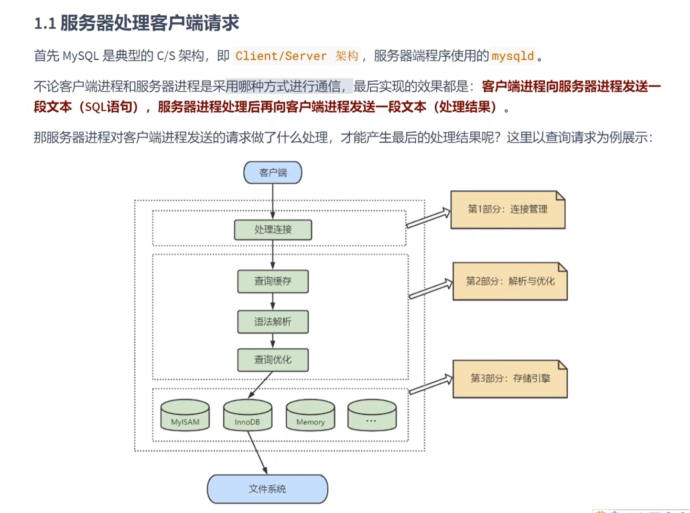


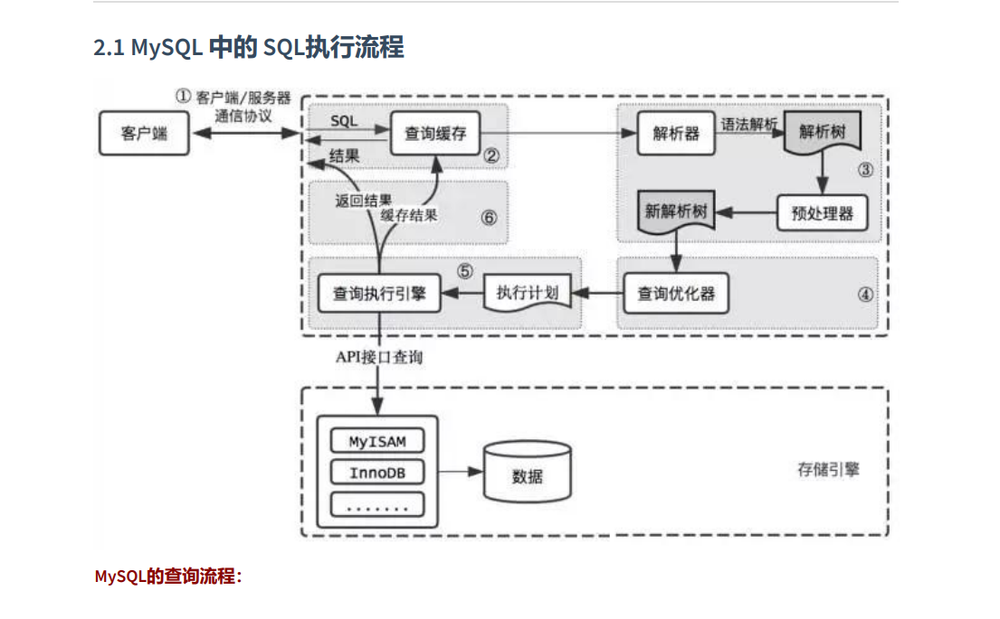

### （二）SQL的执行过程
SQL语句 -> 查询缓存 -> 解析器 -> 优化器 -> 执行器
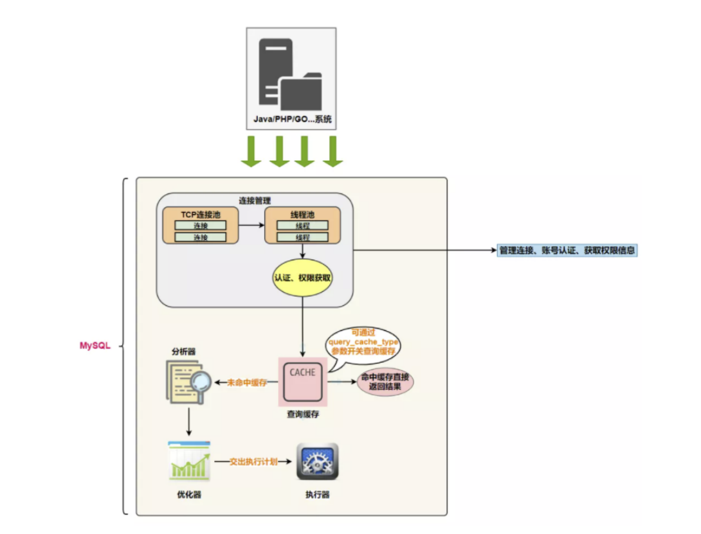

#### 1.解析器
- 词法分析

- 语法分析
  

#### 2.优化器
- 逻辑优化
  - 逻辑查询优化就是通过 SQL 等价变换 提升查询效率，直白一点就是说，换一种查询写法执行效率可能更高。
- 物理优化
  - 物理查询优化则是通过 索引和 表连接方式 等技术来进行优化，这里重点需要掌握索引的使用。

#### 3.执行器

### （三）数据库缓冲池（Buffer Pool）

首先我们需要了解在innoDB 存储引擎中，缓冲池都包括了哪些。
在innoDB 存储引擎中有一部分数据会放到内存中，缓冲池则占了这部分内存的大部分，它用来存储各种数据的
缓存，如下图所示:
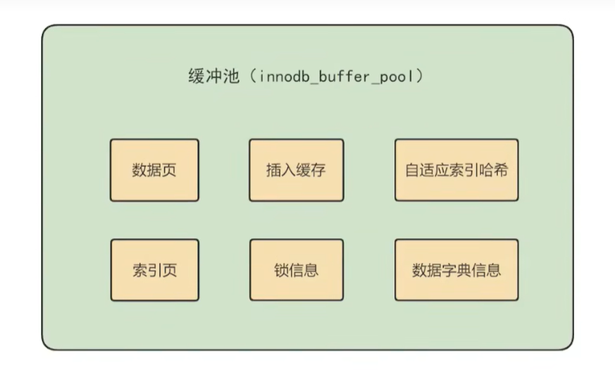
从图中，你能看到InnoDB 缓冲池包括了数据页、索引页、插入缓冲、锁信息、自适应 Hash 和数据字典信息等

##### 缓存池的重要性:
对于使用 InnoDB 作为存储引擎的表来说，不管是用于存储用户数据的索引(包括聚族索引和二级索引)，还是各种系统数据，都是以 <font color='red'>页</font> 的形式存放在 表空间 中的，而所谓的表空间只不过是InnoDB对文件系统上一个或几个实际文件的抽象，也就是说我们的数据说到底还是存储在磁盘上的。但是各位也都知道，磁盘的速度慢的跟乌龟一样，怎么能配得上“快如风，疾如电”的CPU 呢?这里，缓冲池可以帮助我们消除CPU和磁盘之间的 鸿沟。所以InnoDB存储引擎在处理客户端的请求时，当需要访问某个页的数据时，就会把 完整的页的数据全部加载到内存中也就是说即使我们只需要访问一个页的一条记录，那也需要先把整个页的数据加载到内存中。将整个页加载到内存中后就可以进行读写访问了，在进行完读写访问之后并不着急把该页对应的内存空间释放掉，而是将其 缓存起来，这样将来有请求再次访问该页面时，就可以 省去磁盘IO的开销了。

##### 缓存原则:
“ 位置 * 频次 ” 这个原则，可以帮我们对I/0 访问效率进行优化
首先，位置决定效率，提供缓冲池就是为了在内存中可以直接访问数据。
其次，频次决定优先级顺序。因为缓冲池的大小是有限的，比如磁盘有 200G，但是内存只有 16G，缓冲池大小只有 1G，就无法将所有数据都加载到缓冲池里，这时就涉及到优先级顺序，会 优先对使用频次高的热数据进行加载。

##### 缓冲池的预读特性
了解了缓冲池的作用之后，我们还需要了解缓冲池的另一个特性: 预读。缓冲池的作用就是提升 I/O 效率，而我们进行读取数据的时候存在一个“局部性原理”，也就是说我们使用了一些数据，大概率还会使用它周围的一些数据，因此采用“预读”的机制提前加载，可以减少未来可能的磁盘 /0 操作。

#### 2.缓冲池如何读取数据
缓冲池管理器会尽量将经常使用的数据保存起来，在数据库进行页面读操作的时候，首先会判断该页面是否在缓冲池中，如果存在就直接读取，如果不存在，就会通过内存或磁盘将页面存放到缓冲池中再进行读取。
缓存在数据库中的结构和作用如下图所示:
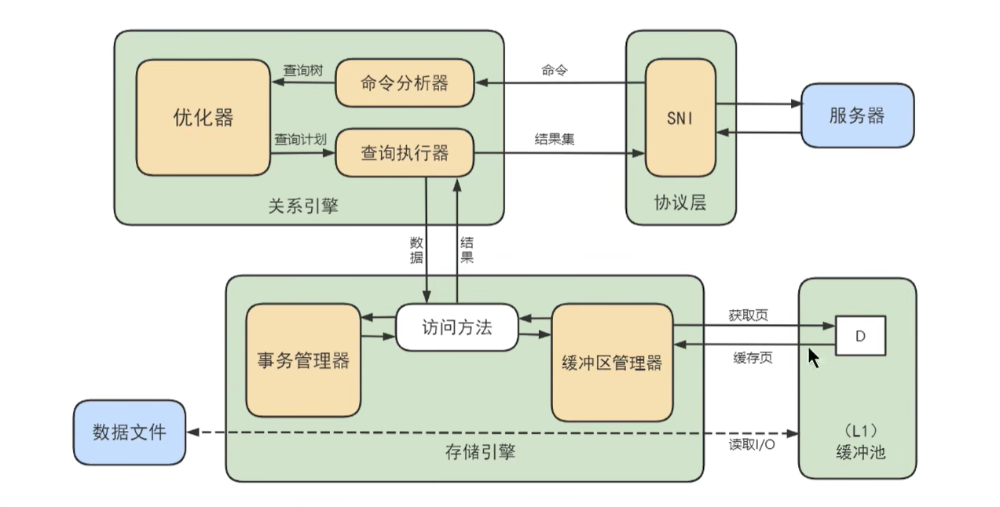

<font color='red'>如果我们执行 SQL 语句的时候更新了缓存池中的数据，那么这些数据会马上同步到磁盘上吗?</font>

实际上，当我们对数据库中的记录进行修改的时候，首先会修改缓冲池中页里面的记录信息，然后数据库会以一定的频率刷新 到磁盘上。注意并不是每次发生更新操作，都会立刻进行磁盘回写。缓冲池会采用一种叫做checipoint 的机制 将数据回写到磁盘上，这样做的好处就是提升了数据库的整体性能。比如，当缓冲池不够用 时，需要释放掉一些不常用的页，此时就可以强行采用 checkpoint 的方式，将不常用的脏页回写到磁盘上，然后再从缓冲池中将这些页释放掉。这里脏页 (dirty page)指的是缓冲池中被修改过的页，与磁盘上的数据页不一致。


#### 3.设置缓存池大小
```sql
#设置缓存池大小为1G
set global innodb_buffer_pool_size = 1073741824
show VARIABLES like '%buffer_pool%'
```

#### 4.多个Buffer Pool实例
Buffer Pool本质是InnoDB向操作系统申请的一块 连续的内存空间，在多线程环境下，访问Bufer Pool中的数据都票要加锁处理。在Buffer Pool特别大而且多线程并发访问特别高的情况下，单一的Buffer Pool可能会影响请求的处理速度。所以在Buffer Pool特别大的时候，我们可以把它们拆分成若千个小的Buffer Pool，每个Buffer Pool都称为一个实例，它们都是独立的，独立的去申请内存空间，独立的管理各种链表。所以在多线程并发访问时并不会相互影响，从而提高并发处理能力。
我们可以在服务器启动的时候通过设置 innodb_buffer_pool_instances 的值来修改Buffer Pool实例的个数比方说这样:
```properties
[server]
innodb_buffer_pool_instance = 2
```
这样就表明我们要创建2个 Buffer Pool 实例
不过也不是说Buffer Pool实例创建的越多越好，分别管理各个Buffer Pool也是需要性能开销的
innoDB规定:当innodb_buffer_pool_size的值小于1G的时候设置多个实例是无效的，InnoDB会默认把innodb_buffer_pool_instances 的值修改为1。而我们鼓励在Buffer Pool大于或等于1G的时候设置多个Buffer Pool实例。

### （四）存储引擎
```sql
show ENGINES;
```

#### 1.InnoDB引擎：具备外键支持功能的分事务存储引擎
- MySQL从3.23.34a开始就包含InnoDB存储引擎。 大于等于5.5之后，默认采用InnoDB引擎。
- InnoDB是MySQL的 默认事务型引擎，它被设计用来处理大量的短期(short-lived)事务。可以确保事务的完整提交(Commit)和回滚(Rollback)。
- 除了增加和查询外，还需要更新、删除操作，那么，应优先选择InnoDB存储引擎
- 除非有非常特别的原因需要使用其他的存储引擎，否则应该优先考虑InnoDB引擎
- 数据文件结构: 
  - 表名.frm 存储表结构 (MySQL8.0时，合并在表名.ibd中)
  - 表名.ibd 存储数据和索引
- InnoDB是 为处理巨大数据量的最大性能设计
  - 在以前的版本中，字典数据以元数据文件、非事务表等来存储。现在这些元数据文件被删除了。比如: .frm， .par， .trn， .isl， .db.opt 等都在MySQL8.0中不存在了
- 对比MyISAM的存储引擎，InnoDB写的处理效率差一些，并且会占用更多的磁盘空间以保存数据和索引
- MyISAM只缓存索引，不缓存真实数据，InnoDB不仅缓存索引还要缓存真实数据，对内存要求较高，而且内存

#### 2.MyISAM引擎:主要的非事务处理存储引擎
- MyISAM提供了大量的特性，包括全文索引、压缩、空间函数(GIS)等，但MyISAM不持事务、行级锁、外键，有一个毫无疑问的缺陷就是 崩溃后无法安全恢复。
- 5.5之前默认的存储引擎
- 优势是访问的 速度快，对事务完整性没有要求或者以SELECT、INSERT为主的应用。针对数据统计有额外的常数存储。故而 count()的查询效率很高
- 数据文件结构: (在《第02章_MySOL数据目录》章节已讲)
  - 表名.frm 存储表结构
  - 表名MYD 存储数据(MYData)
  - 表名.MYI 存储索引 (MYIndex)
- 应用场景:只读应用或者以读为主的业务

#### 3.Archive引擎：用于数据存档
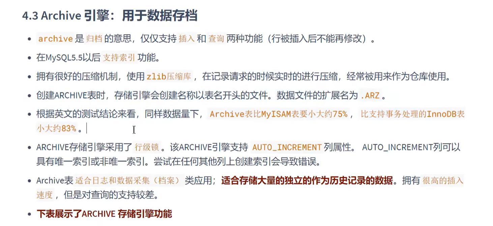


#### 4.Blackhole引擎：丢弃写操作，读操作会返回空内容


#### 5.CSV引擎：存储数据时，以逗号分隔各个数据项


#### 6.Memory引擎：至于内存的表
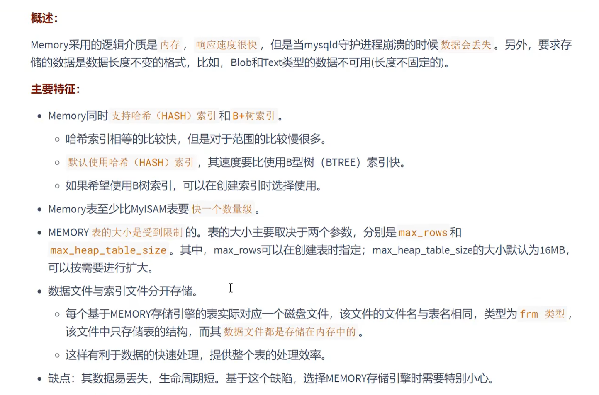

#### 7.其他引擎
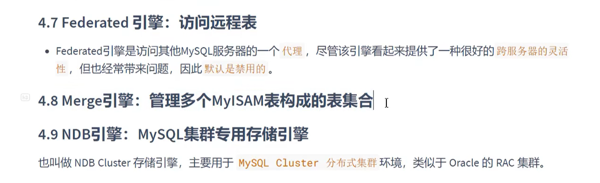

## 二、索引的数据结构

### （一）InnoDB中索引的推演

#### 1.简单的索引设计方案
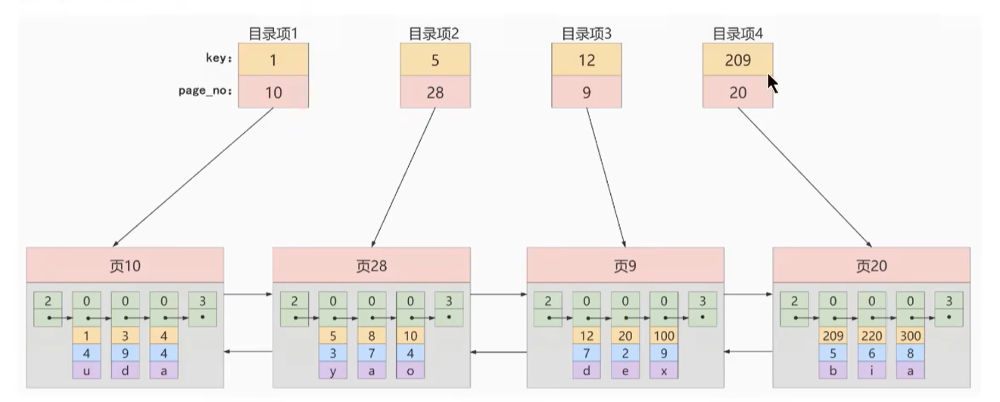

#### 2.InnoDB的索引方案

##### (1) 迭代1次：目录项记录的页
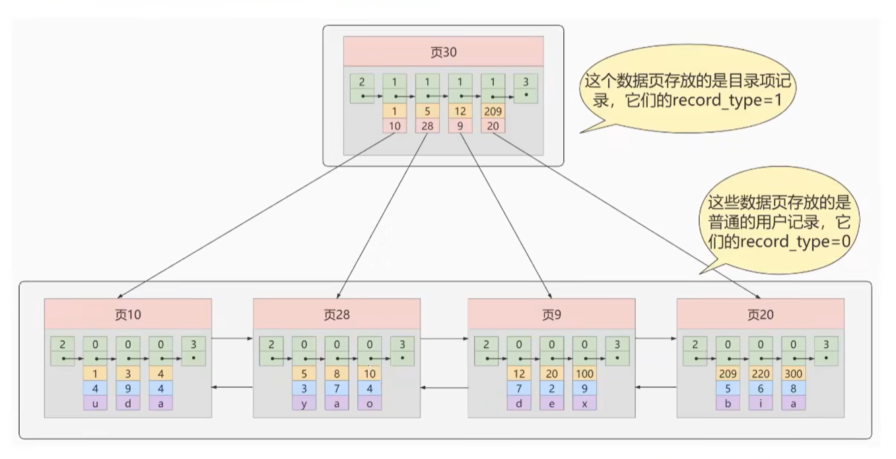

##### (2) 迭代2次：多个目录项记录的页
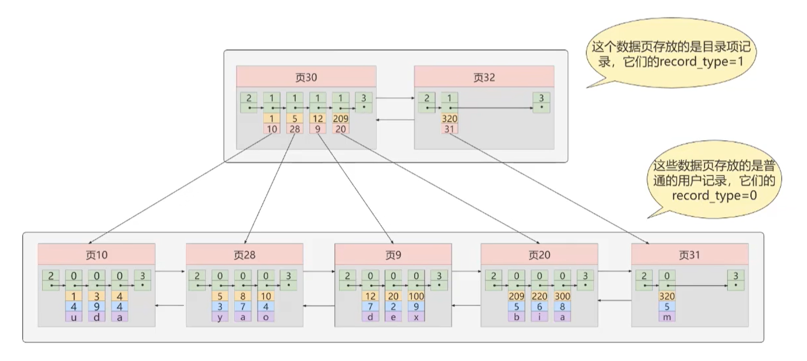

##### (3) 迭代3次，目录项记录页的目录页
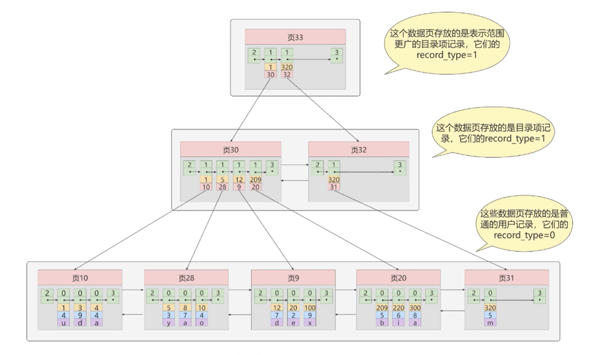

#### 3.常见索引概念

##### (1)聚簇索引

##### (2)二级索引（/辅助索引/非聚簇索引）
> 概念：回表 我们根据这个以c2列大小排序的B+树只能确定我们要查找记录的主键值，所以如果我们想根
据c2列的值查找到完整的用户记录的话，仍然需要到 聚簇索引 中再查一遍，这个过程称为 回表 。也就
是根据c2列的值查询一条完整的用户记录需要使用到 2 棵B+树！

##### (3)联合索引

#### 4.注意事项
- 根节点位置万年不动。实际上，一个B+Tree索引的根节点自索引创建时起就被创建了，且不会再移动。

### （二） MyISAM中的索引
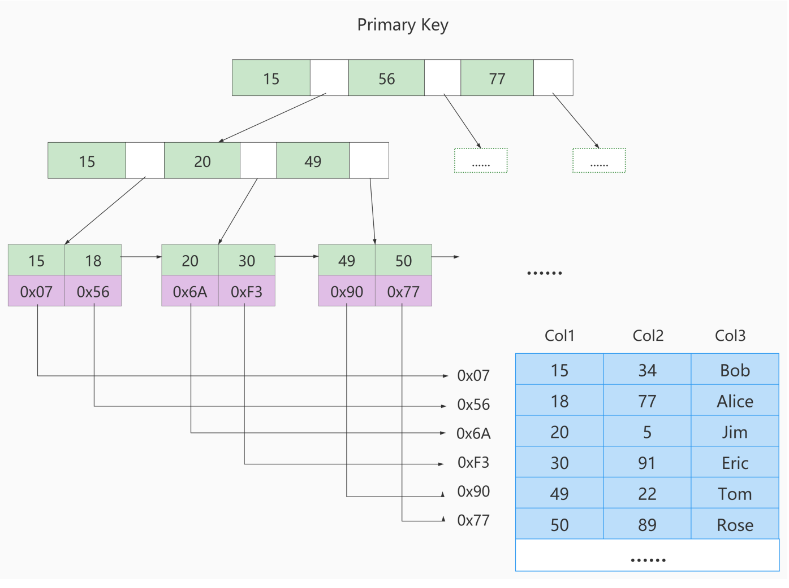

### （三） MySQL索引数据结构选择的合理性
#### 1.Hash结构

#### 2.二叉搜索树

#### 3.平衡二叉树（AVL树）

#### 4.B-Tree

#### 5.B+Tree

> 思考题：为了减少IO，索引树会一次性加载吗？
> 


> 思考题：B+树的存储能力如何？为何说一般查找行记录，最多只需1~3次磁盘IO
> 
> InnoDB 存储引擎中页的大小为 16KB，一般表的主键类型为INT(占用4个字节)或BIGINT(占用8个字节)，指针类型也一般为4或8个字节，也就是说一个页 (B+Tree 中的一个节点)中大概存储16KB/(8B+8B)=1K 个键值(因为是估值，为方便计算，这里的K取值为 103。也就是说一个深度为3的B+Tree 索引可以维护 10N3*103103 = 10 亿条记录。(这里假定一个数据页也存储103条行记录数据了)
实际情况中每个节点可能不能填充满，因此在数据库中，B+Tree 的高度一般都在 2~4 层。MySQL的InnoDB 存储引擎在设计时是将根节点常驻内存的，也就是说查找某一键值的行记录时最多只需要 1~3次磁盘l/0 操作。

> 思考题：为什么说B+树比B-树更适合实际应用中操作系统的文件索引和数据库索引？
> 

> 思考题：Hash 索引与 B+ 树索引的区别
> 

> 我们之前讲到过 B+ 树索引的结构，Hash 索引结构和 B+ 树的不同，因此在索引使用上也会有差别
> - Hash 索引不能进行<font color='red'>范围查询</font>，而 B+ 树可以。这是因为 Hash 索引指向的数据是无序的，而 B+ 树的叶子节点是个有序的链表。
> - Hash 索引不支持<font color='red'>联合索引的最左侧原则</font> (即联合索引的部分索引无法使用)，而 B+ 树可以。对于联合索引来说，Hash 索引在计算 Hash 值的时候是将索引键合并后再一起计算 Hash;值，所以不会针对每个索引单独计算 Hash 值。因此如果用到联合索引的一个或者几个索引时，联合索引无法被利用
> - Hash 索引不支持<font color='red'> ORDER BY 排序 </font>，因为 Hash 索引指向的数据是无序的，因此无法起到排序优化的作用，而B+ 树索引数据是有序的，可以起到对该字段 ORDER BY排序优化的作用。同理，我们也无法用 Hash索引进行 模糊查询，而 B+ 树使用 LIKE 进行模糊查询的时候，LIKE 后面后模糊查询(比如 % 结尾)的话就可
> - InnoDB 不支持Hash索引

> 思考题：Hash 索引与 B+ 树索引是在建索引的时候手动指定的吗？
> 

## 三、InnoDB数据存储结构
### （一）数据库的存储结构：页

### （二）页的内部结构
页如果按类型划分的话，常见的有 `数据页(保存 B+ 树节点)`、`系统页`、`Undo页`和 `事务数据页` 等，数据页是我们最常使用的页。
数据页的 16KB 大小的存储空间被划分为七个部分，分别是：
- 文件头 (File Header)
- 页头 (Page Header)
- 最大最小记录 (Infimumtsupremum)
- 用户记录 (User Records)
- 空闲空间 (Free Space)
- 页目录(PageDirectory)
- 文件尾 (File Tailer)

页结构的示意图如下所示:
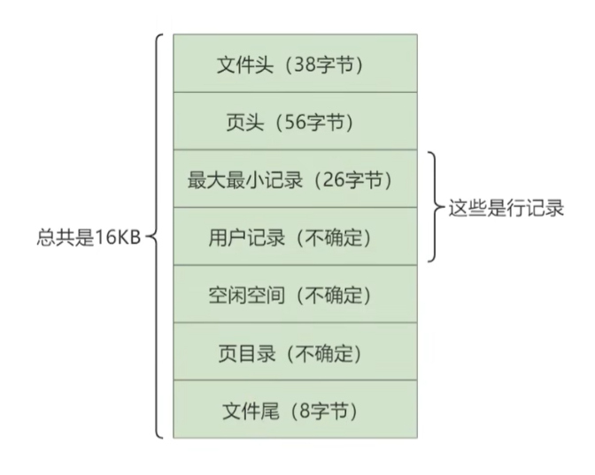


## 四、索引

### （一）索引的分类
- 从`功能逻辑`上说，索引主要有 4 种，分别是普通索引、唯一索引、主键索引、全文索引。
- 按照`物理实现方式`，索引可以分为 2 种：聚簇索引和非聚簇索引。
- 按照`作用字段个数`进行划分，分成单列索引和联合索引。

### （二）MySQL8.0索引新特性
#### 1.支持降序索引

#### 2.隐藏索引

### （三）哪些情况适合创建索引
#### 1.字段的数值有唯一性的限制
#### 2.频繁作为 WHERE 查询条件的字段
#### 3.经常 GROUP BY 和 ORDER BY 的列
#### 4.UPDATE、DELETE 的 WHERE 条件列
#### 5.DISTINCT 字段需要创建索引
#### 6.多表 JOIN 连接操作时，创建索引注意事项
- 连接表的数量尽量不要超过 3 张
- 对 WHERE 条件创建索引
- 对用于连接的字段创建索引
#### 7.使用列的类型小的创建索引
#### 8.使用字符串前缀创建索引
```sql
select count(distinct left(列名, 索引长度)) / count(0) from 表;
```
尝试索引长度：
- 返回值越趋近于1，索引效果越好
- 如果不同的索引长度返回的数值相近，则索引效果无明显差别

#### 9.区分度高(散列性高)的列适合作为索引
```sql
select count(distinct 列名) / count(0) from 表;
```
计算区分度越接近1越好，一般认为，输出结果超过0.33就算是比较高效的索引了

#### 10. 使用最频繁的列放到联合索引的左侧

#### 11.在多个字段都要创建索引的情况下，联合索引优于单值索引

#### 12.限制索引的数量
- 单表建议索引数量不超过6个

### （四）哪些情况不适合创建索引


## 二、SQL优化

### （三）性能分析工具
#### 1.查看系统性能参数
```sql
show status;
```
- Connections: 连接mysql服务的次数
- Uptime: MySQL服务器的上线时间
- Slow_queries: 慢查询的次数
- Innodb_row_inserted: 执行insert操作插入的行数
- Innodb_row_updated: 执行update操作更新的行数
- Innodb_row_deleted: 执行delete操作删除的行数
- Com_select: 查询操作的次数
- Com_insert: 插入操作的次数，批量插入只算作1次
- Com_update: 更新操作的次数
- Com_delete: 删除操作的次数

#### 2.统计SQL的查询成本
```sql
show status like 'last_query_cost';
```

#### 3.定位执行慢的 SQL：慢查询日志
```sql
# 查看是否开启慢SQL日志
show variables like 'slow_query_log';

# 开启全局慢SQL日志
set global slow_query_log = on;
    
# 查看慢SQL日志存储位置
show variables like 'slow_query_log_file';

# 查询long_query_time阈值
show variables like 'long_query_time';

# 修改long_query_time阈值, 全局or会话级别, 最好都改
set long_query_time = 1;
set global long_query_time = 1;
```

```sql
# 查看慢SQL
show status like 'slow_queries';
```
> 除了上述变量，控制慢查询日志的还有一个系统变量: ```sql show variables like 'min_examined_row_limit'; #默认是0```。这个变量的意思是，查询扫描过的最少记录数。这个变量和查询执行时间，共同组成了判别一个查询是否是慢查询的条件。如果查询扫描过的记录数大于等于这个变量的值，并且查询执行时间超过long_query_time 的值，那么，这个查询就被记录到慢查询日志中;反之，则不被记录到慢查询日志中。

```shell
cd /var/lib/mysql
mysqldumpslow -s t -a -t 5 92cdb7d4d0fc-slow.log
```
```shell
mysqladmin -uroot -p flush-logs slow
```

#### 4.查看SQL执行成本
```sql
show variables like 'profiling';
set profiling = on;
show profiles;
show profile cpu, block io for query 83;
```

```sql
#不使用条件下推
select /*+ no_ipc field */ * from t where ...;
```

#### 5.分析查询语句：explain/describe
##### 各列的作用
| 列名             | 描述                                                      |
|----------------|---------------------------------------------------------|
| id             | 唯一id，<br/>一般情况下，有几个select就有几个不同的id，但有可能查询优化器可能会对涉及子查询的语句进行重写 |
| select_type    | SELECT关键字对应的那个查询的类型                                     |
| table          | 表名                                                      |
| partitions     | 匹配的分区信息                                                 |
| type           | 针对单表的访问方法                                               |
| possiable_keys | 可能用到的索引                                                 |
| key            | 实际上使用的索引                                                |
| key_len        | 实际使用到的索引长度                                              |
| ref            | 当使用索引列等值查询时，与索引列进行等值匹配的对象信息                             |
| rows           | 预估的需要读取的记录条数                                            |
| filtered       | 某个表经过搜索条件过滤后剩余记录条数的百分比                                  |
| Extra          | 额外的信息                                                   |

##### (1) id
- id如果相同，可以认为是一组，从上往下顺序执行
- 在所有组中，id值越大，优先级越高，越先执行
- id每个号码，都代表一趟独立的查询，一个sql查询趟数越少越好

##### (2) select_type
- SIMPLE
- PRIMARY
- UNION
- UNION RESULT
- SUBQUERY
- DEPENDENT SUBQUERY
- DEPENDENT UNION
- DERIVED
- MATERIALIZED
- UNCACHEABLE SUBQUERY
- UNCHANGEABLE UNION

##### (3) type
- `system`: 当表中只有一条记录，且该表使用的存储引擎是MyISAM或者MEMORY，那么对该表的访问方法就是`system`
- `const`: 当根据主键或者唯一索引或者常数进行等值匹配时，对单表的访问方法就是`const`
- `eq_ref`: 如果被驱动表是通过主键或者唯一二级索引列等值匹配的方式进行访问的（如果主键或者唯一二级索引是联合索引，所有索引列都必须进行等值比较），则对该被驱动表的访问方法就是`eq_ref`
- `ref`: 普通二级索引列与常量进行等值匹配来查询时，那么对该表的访问方法可能是`ref`。注意数据类型！一旦字段发生隐式转换，索引失效，即访问方法改为`ALL`
- `ref_or_null`: 普通二级索引进行等值查询，且该索引列的值可以为null时，那么对该表的访问方法可能是`ref_or_null`
- `index_merge`: 单表访问方法在某些场景下可以使用`Intersection`、`Union`、`Sort_Union`这三种索引合并的方式来执行查询
 ```sql 
explain select * from s1 where key1 = 'a' or key2 = 'b' 
```
- `unique_subquery`: 
- `range`: 如果使用索引获取某些范围区间的记录，那么。。
- `index`
- `ALL`

```
小结：
结果值从最好到最坏依次是:
  system > const > eq_ref> ref
 > fulltext > ref_or_null > index_merge > unique_subquery > index_subquery
 > range > index > ALL
SQL 性能优化的目标: 至少要达到 range 级别，要求是 ref级别，最好是 consts级别。 (阿里巴巴开发手册要求)
```

##### (12) Extra
No table used
Using Index condition -> 索引下推

#### 6.分析优化器执行计划：trace

#### 7.MySQL监控分析视图：sys.schema
索引情况：
```sql
#1. 查询冗余索引
select * from sys.schema_redundant_indexes;
#2. 查询未使用过的索引
select * from sys.schema_unused_indexes;
#3. 查询索引的使用情况
select index_name,rows_selected,rows_inserted,rows_updated,rows_deleted
from sys.schema_index_statistics where table_schema='dbname' ;
```
表相关：
```sql
# 1. 查询表的访问量
select table_schema,table_name,sum(io_read_requests+io_write_requests) as io from
sys.schema_table_statistics group by table_schema,table_name order by io desc;
# 2. 查询占用bufferpool较多的表
select object_schema,object_name,allocated,data
from sys.innodb_buffer_stats_by_table order by allocated limit 10;
# 3. 查看表的全表扫描情况
select * from sys.statements_with_full_table_scans where db='dbname';
```

语句相关：
```sql
#1. 监控SQL执行的频率
select db,exec_count,query from sys.statement_analysis
order by exec_count desc;
#2. 监控使用了排序的SQL
select db,exec_count,first_seen,last_seen,query
from sys.statements_with_sorting limit 1;
#3. 监控使用了临时表或者磁盘临时表的SQL
select db,exec_count,tmp_tables,tmp_disk_tables,query
from sys.statement_analysis where tmp_tables>0 or tmp_disk_tables >0
order by (tmp_tables+tmp_disk_tables) desc;
```


#### 索引失效的案例
- 

#### 覆盖索引

#### 索引下推
走索引的查询，先不着急回表，先过滤其他条件，然后再回表，减少回表随机IO

```sql
#关闭索引条件下推
set optimizer_switch = 'index_condition_pushdown = off';


```


## 数据库设计规范

### 1.第一范式
第一范式主要是确保表中每个字段的值必须具有原子性，即 每个字段的值不可再拆分

### 2.第二范式
满足第一范式的基础上，满足，数据表中的每条记录，都是可唯一标识的，而且所有非主键字段，都必须完全依赖主键字段，不能只依赖主键的一部分。

#### 1.哪些维度可以进行数据库调优？
- 索引失效，没有充分利用索引     ———— 建立索引
- 关联查询太多JOIN (设计缺陷或不得已的需求) --SQL优化
- 服务器调优及各个参数设置 (缓冲、线程数等)--调整my.cnf
- 数据过多--分库分表

```markdown
关于数据库调优的知识点非常分散。不同的 DBMS，不同的公司，不同的职位，不同的项目遇到的问题都不尽相同。这里我们分为三个章节进行细致讲解
```
  把 SQL 查询优化分成两个部分，逻辑查询优化和物理查询优化。虽然 SOL 查询优化的技术有很多，但是大方向上完全可以分成、物理查询优化 和 逻辑查询优化 两大块。
- 物理查询优化则是通过 索引和 表连接方式 等技术来进行优化，这里重点需要掌握索引的使用。 
- 逻辑查询优化就是通过 SOL 等价变换 提升查询效率，直白一点就是说，换一种查询写法执行效率可能更高.

## MySQL常见的7中日志