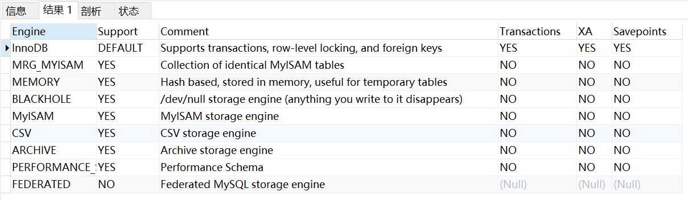

# MySQL学习笔记
https://www.bilibili.com/video/BV1iq4y1u7vj/?p=120&spm_id_from=pageDriver&vd_source=d09d71b177881fe56ce7427e5cbdd2b8

## 一、MySQL系统架构

### （一）架构组成
mysql服务架构分为
- 连接层
- 服务层
- 引擎层


### （二）SQL的执行过程
SQL语句 -> 查询缓存 -> 解析器 -> 优化器 -> 执行器


#### 1.解析器
- 词法分析

- 语法分析
  

#### 2.优化器
- 逻辑优化
  - 逻辑查询优化就是通过 SQL 等价变换 提升查询效率，直白一点就是说，换一种查询写法执行效率可能更高。
- 物理优化
  - 物理查询优化则是通过 索引和 表连接方式 等技术来进行优化，这里重点需要掌握索引的使用。

#### 3.执行器

### （三）数据库缓冲池（Buffer Pool）

首先我们需要了解在innoDB 存储引擎中，缓冲池都包括了哪些。
在innoDB 存储引擎中有一部分数据会放到内存中，缓冲池则占了这部分内存的大部分，它用来存储各种数据的
缓存，如下图所示:

从图中，你能看到InnoDB 缓冲池包括了数据页、索引页、插入缓冲、锁信息、自适应 Hash 和数据字典信息等

##### 缓存池的重要性:
对于使用 InnoDB 作为存储引擎的表来说，不管是用于存储用户数据的索引(包括聚族索引和二级索引)，还是各种系统数据，都是以 <font color='red'>页</font> 的形式存放在 表空间 中的，而所谓的表空间只不过是InnoDB对文件系统上一个或几个实际文件的抽象，也就是说我们的数据说到底还是存储在磁盘上的。但是各位也都知道，磁盘的速度慢的跟乌龟一样，怎么能配得上“快如风，疾如电”的CPU 呢?这里，缓冲池可以帮助我们消除CPU和磁盘之间的 鸿沟。所以InnoDB存储引擎在处理客户端的请求时，当需要访问某个页的数据时，就会把 完整的页的数据全部加载到内存中也就是说即使我们只需要访问一个页的一条记录，那也需要先把整个页的数据加载到内存中。将整个页加载到内存中后就可以进行读写访问了，在进行完读写访问之后并不着急把该页对应的内存空间释放掉，而是将其 缓存起来，这样将来有请求再次访问该页面时，就可以 省去磁盘IO的开销了。

##### 缓存原则:
“ 位置 * 频次 ” 这个原则，可以帮我们对I/0 访问效率进行优化
首先，位置决定效率，提供缓冲池就是为了在内存中可以直接访问数据。
其次，频次决定优先级顺序。因为缓冲池的大小是有限的，比如磁盘有 200G，但是内存只有 16G，缓冲池大小只有 1G，就无法将所有数据都加载到缓冲池里，这时就涉及到优先级顺序，会 优先对使用频次高的热数据进行加载。

##### 缓冲池的预读特性
了解了缓冲池的作用之后，我们还需要了解缓冲池的另一个特性: 预读。缓冲池的作用就是提升 I/O 效率，而我们进行读取数据的时候存在一个“局部性原理”，也就是说我们使用了一些数据，大概率还会使用它周围的一些数据，因此采用“预读”的机制提前加载，可以减少未来可能的磁盘 /0 操作。

#### 2.缓冲池如何读取数据
缓冲池管理器会尽量将经常使用的数据保存起来，在数据库进行页面读操作的时候，首先会判断该页面是否在缓冲池中，如果存在就直接读取，如果不存在，就会通过内存或磁盘将页面存放到缓冲池中再进行读取。
缓存在数据库中的结构和作用如下图所示:


<font color='red'>如果我们执行 SQL 语句的时候更新了缓存池中的数据，那么这些数据会马上同步到磁盘上吗?</font>

实际上，当我们对数据库中的记录进行修改的时候，首先会修改缓冲池中页里面的记录信息，然后数据库会以一定的频率刷新 到磁盘上。注意并不是每次发生更新操作，都会立刻进行磁盘回写。缓冲池会采用一种叫做checipoint 的机制 将数据回写到磁盘上，这样做的好处就是提升了数据库的整体性能。比如，当缓冲池不够用 时，需要释放掉一些不常用的页，此时就可以强行采用 checkpoint 的方式，将不常用的脏页回写到磁盘上，然后再从缓冲池中将这些页释放掉。这里脏页 (dirty page)指的是缓冲池中被修改过的页，与磁盘上的数据页不一致。


#### 3.设置缓存池大小
```sql
#设置缓存池大小为1G
set global innodb_buffer_pool_size = 1073741824
show VARIABLES like '%buffer_pool%'
```

#### 4.多个Buffer Pool实例
Buffer Pool本质是InnoDB向操作系统申请的一块 连续的内存空间，在多线程环境下，访问Bufer Pool中的数据都票要加锁处理。在Buffer Pool特别大而且多线程并发访问特别高的情况下，单一的Buffer Pool可能会影响请求的处理速度。所以在Buffer Pool特别大的时候，我们可以把它们拆分成若千个小的Buffer Pool，每个Buffer Pool都称为一个实例，它们都是独立的，独立的去申请内存空间，独立的管理各种链表。所以在多线程并发访问时并不会相互影响，从而提高并发处理能力。
我们可以在服务器启动的时候通过设置 innodb_buffer_pool_instances 的值来修改Buffer Pool实例的个数比方说这样:
```properties
[server]
innodb_buffer_pool_instance = 2
```
这样就表明我们要创建2个 Buffer Pool 实例
不过也不是说Buffer Pool实例创建的越多越好，分别管理各个Buffer Pool也是需要性能开销的
innoDB规定:当innodb_buffer_pool_size的值小于1G的时候设置多个实例是无效的，InnoDB会默认把innodb_buffer_pool_instances 的值修改为1。而我们鼓励在Buffer Pool大于或等于1G的时候设置多个Buffer Pool实例。

### （四）存储引擎
```sql
show ENGINES;
```

#### 1.InnoDB引擎：具备外键支持功能的分事务存储引擎
- MySQL从3.23.34a开始就包含InnoDB存储引擎。 大于等于5.5之后，默认采用InnoDB引擎。
- InnoDB是MySQL的 默认事务型引擎，它被设计用来处理大量的短期(short-lived)事务。可以确保事务的完整提交(Commit)和回滚(Rollback)。
- 除了增加和查询外，还需要更新、删除操作，那么，应优先选择InnoDB存储引擎
- 除非有非常特别的原因需要使用其他的存储引擎，否则应该优先考虑InnoDB引擎
- 数据文件结构: 
  - 表名.frm 存储表结构 (MySQL8.0时，合并在表名.ibd中)
  - 表名.ibd 存储数据和索引
- InnoDB是 为处理巨大数据量的最大性能设计
  - 在以前的版本中，字典数据以元数据文件、非事务表等来存储。现在这些元数据文件被删除了。比如: .frm， .par， .trn， .isl， .db.opt 等都在MySQL8.0中不存在了
- 对比MyISAM的存储引擎，InnoDB写的处理效率差一些，并且会占用更多的磁盘空间以保存数据和索引
- MyISAM只缓存索引，不缓存真实数据，InnoDB不仅缓存索引还要缓存真实数据，对内存要求较高，而且内存

#### 2.MyISAM引擎:主要的非事务处理存储引擎
- MyISAM提供了大量的特性，包括全文索引、压缩、空间函数(GIS)等，但MyISAM不持事务、行级锁、外键，有一个毫无疑问的缺陷就是 崩溃后无法安全恢复。
- 5.5之前默认的存储引擎
- 优势是访问的 速度快，对事务完整性没有要求或者以SELECT、INSERT为主的应用。针对数据统计有额外的常数存储。故而 count()的查询效率很高
- 数据文件结构: (在《第02章_MySOL数据目录》章节已讲)
  - 表名.frm 存储表结构
  - 表名MYD 存储数据(MYData)
  - 表名.MYI 存储索引 (MYIndex)
- 应用场景:只读应用或者以读为主的业务

#### 3.Archive引擎：用于数据存档


#### 4.Blackhole引擎：丢弃写操作，读操作会返回空内容


#### 5.CSV引擎：存储数据时，以逗号分隔各个数据项


#### 6.Memory引擎：至于内存的表


#### 7.其他引擎


## 二、索引的数据结构

### （一）InnoDB中索引的推演

#### 1.简单的索引设计方案


#### 2.InnoDB的索引方案

##### (1) 迭代1次：目录项记录的页


##### (2) 迭代2次：多个目录项记录的页


##### (3) 迭代3次，目录项记录页的目录页


#### 3.常见索引概念

##### (1)聚簇索引

##### (2)二级索引（/辅助索引/非聚簇索引）
> 概念：回表 我们根据这个以c2列大小排序的B+树只能确定我们要查找记录的主键值，所以如果我们想根
据c2列的值查找到完整的用户记录的话，仍然需要到 聚簇索引 中再查一遍，这个过程称为 回表 。也就
是根据c2列的值查询一条完整的用户记录需要使用到 2 棵B+树！

##### (3)联合索引

#### 4.注意事项
- 根节点位置万年不动。实际上，一个B+Tree索引的根节点自索引创建时起就被创建了，且不会再移动。

### （二） MyISAM中的索引


### （三） MySQL索引数据结构选择的合理性
#### 1.Hash结构

#### 2.二叉搜索树

#### 3.平衡二叉树（AVL树）

#### 4.B-Tree

#### 5.B+Tree

> 思考题：为了减少IO，索引树会一次性加载吗？
> 


> 思考题：B+树的存储能力如何？为何说一般查找行记录，最多只需1~3次磁盘IO
> 
> InnoDB 存储引擎中页的大小为 16KB，一般表的主键类型为INT(占用4个字节)或BIGINT(占用8个字节)，指针类型也一般为4或8个字节，也就是说一个页 (B+Tree 中的一个节点)中大概存储16KB/(8B+8B)=1K 个键值(因为是估值，为方便计算，这里的K取值为 103。也就是说一个深度为3的B+Tree 索引可以维护 10N3*103103 = 10 亿条记录。(这里假定一个数据页也存储103条行记录数据了)
实际情况中每个节点可能不能填充满，因此在数据库中，B+Tree 的高度一般都在 2~4 层。MySQL的InnoDB 存储引擎在设计时是将根节点常驻内存的，也就是说查找某一键值的行记录时最多只需要 1~3次磁盘l/0 操作。

> 思考题：为什么说B+树比B-树更适合实际应用中操作系统的文件索引和数据库索引？
> 

> 思考题：Hash 索引与 B+ 树索引的区别
> 

> 我们之前讲到过 B+ 树索引的结构，Hash 索引结构和 B+ 树的不同，因此在索引使用上也会有差别
> - Hash 索引不能进行<font color='red'>范围查询</font>，而 B+ 树可以。这是因为 Hash 索引指向的数据是无序的，而 B+ 树的叶子节点是个有序的链表。
> - Hash 索引不支持<font color='red'>联合索引的最左侧原则</font> (即联合索引的部分索引无法使用)，而 B+ 树可以。对于联合索引来说，Hash 索引在计算 Hash 值的时候是将索引键合并后再一起计算 Hash;值，所以不会针对每个索引单独计算 Hash 值。因此如果用到联合索引的一个或者几个索引时，联合索引无法被利用
> - Hash 索引不支持<font color='red'> ORDER BY 排序 </font>，因为 Hash 索引指向的数据是无序的，因此无法起到排序优化的作用，而B+ 树索引数据是有序的，可以起到对该字段 ORDER BY排序优化的作用。同理，我们也无法用 Hash索引进行 模糊查询，而 B+ 树使用 LIKE 进行模糊查询的时候，LIKE 后面后模糊查询(比如 % 结尾)的话就可
> - InnoDB 不支持Hash索引

> 思考题：Hash 索引与 B+ 树索引是在建索引的时候手动指定的吗？
> 

## 三、InnoDB数据存储结构
### （一）数据库的存储结构：页

### （二）页的内部结构
页如果按类型划分的话，常见的有 `数据页(保存 B+ 树节点)`、`系统页`、`Undo页`和 `事务数据页` 等，数据页是我们最常使用的页。
数据页的 16KB 大小的存储空间被划分为七个部分，分别是：
- 文件头 (File Header)
- 页头 (Page Header)
- 最大最小记录 (Infimumtsupremum)
- 用户记录 (User Records)
- 空闲空间 (Free Space)
- 页目录(PageDirectory)
- 文件尾 (File Tailer)

页结构的示意图如下所示:


## 四、索引

### （一）索引的分类
- 从`功能逻辑`上说，索引主要有 4 种，分别是普通索引、唯一索引、主键索引、全文索引。
- 按照`物理实现方式`，索引可以分为 2 种：聚簇索引和非聚簇索引。
- 按照`作用字段个数`进行划分，分成单列索引和联合索引。

### （二）MySQL8.0索引新特性
#### 1.支持降序索引

#### 2.隐藏索引

### （三）哪些情况适合创建索引
#### 1.字段的数值有唯一性的限制
#### 2.频繁作为 WHERE 查询条件的字段
#### 3.经常 GROUP BY 和 ORDER BY 的列
#### 4.UPDATE、DELETE 的 WHERE 条件列
#### 5.DISTINCT 字段需要创建索引
#### 6.多表 JOIN 连接操作时，创建索引注意事项
- 连接表的数量尽量不要超过 3 张
- 对 WHERE 条件创建索引
- 对用于连接的字段创建索引
#### 7.使用列的类型小的创建索引
#### 8.使用字符串前缀创建索引
```sql
select count(distinct left(列名, 索引长度)) / count(0) from 表;
```
尝试索引长度：
- 返回值越趋近于1，索引效果越好
- 如果不同的索引长度返回的数值相近，则索引效果无明显差别

#### 9.区分度高(散列性高)的列适合作为索引
```sql
select count(distinct 列名) / count(0) from 表;
```
计算区分度越接近1越好，一般认为，输出结果超过0.33就算是比较高效的索引了

#### 10. 使用最频繁的列放到联合索引的左侧

#### 11.在多个字段都要创建索引的情况下，联合索引优于单值索引

#### 12.限制索引的数量
- 单表建议索引数量不超过6个

### （四）哪些情况不适合创建索引


## 五、SQL优化

### （三）性能分析工具
#### 1.查看系统性能参数
```sql
show status;
```
- Connections: 连接mysql服务的次数
- Uptime: MySQL服务器的上线时间
- Slow_queries: 慢查询的次数
- Innodb_row_inserted: 执行insert操作插入的行数
- Innodb_row_updated: 执行update操作更新的行数
- Innodb_row_deleted: 执行delete操作删除的行数
- Com_select: 查询操作的次数
- Com_insert: 插入操作的次数，批量插入只算作1次
- Com_update: 更新操作的次数
- Com_delete: 删除操作的次数

#### 2.统计SQL的查询成本
```sql
show status like 'last_query_cost';
```

#### 3.定位执行慢的 SQL：慢查询日志
```sql
# 查看是否开启慢SQL日志
show variables like 'slow_query_log';

# 开启全局慢SQL日志
set global slow_query_log = on;
    
# 查看慢SQL日志存储位置
show variables like 'slow_query_log_file';

# 查询long_query_time阈值
show variables like 'long_query_time';

# 修改long_query_time阈值, 全局or会话级别, 最好都改
set long_query_time = 1;
set global long_query_time = 1;
```

```sql
# 查看慢SQL
show status like 'slow_queries';
```
> 除了上述变量，控制慢查询日志的还有一个系统变量: ```sql show variables like 'min_examined_row_limit'; #默认是0```。这个变量的意思是，查询扫描过的最少记录数。这个变量和查询执行时间，共同组成了判别一个查询是否是慢查询的条件。如果查询扫描过的记录数大于等于这个变量的值，并且查询执行时间超过long_query_time 的值，那么，这个查询就被记录到慢查询日志中;反之，则不被记录到慢查询日志中。

```shell
cd /var/lib/mysql
mysqldumpslow -s t -a -t 5 92cdb7d4d0fc-slow.log
```
```shell
mysqladmin -uroot -p flush-logs slow
```

#### 4.查看SQL执行成本
```sql
show variables like 'profiling';
set profiling = on;
show profiles;
show profile cpu, block io for query 83;
```

```sql
#不使用条件下推
select /*+ no_ipc field */ * from t where ...;
```

#### 5.分析查询语句：explain/describe
##### 各列的作用
| 列名           | 描述                                                         |
| -------------- | ------------------------------------------------------------ |
| id             | 唯一id，<br/>一般情况下，有几个select就有几个不同的id，但有可能查询优化器可能会对涉及子查询的语句进行重写 |
| select_type    | SELECT关键字对应的那个查询的类型                             |
| table          | 表名                                                         |
| partitions     | 匹配的分区信息                                               |
| type           | 针对单表的访问方法                                           |
| possiable_keys | 可能用到的索引                                               |
| key            | 实际上使用的索引                                             |
| key_len        | 实际使用到的索引长度                                         |
| ref            | 当使用索引列等值查询时，与索引列进行等值匹配的对象信息       |
| rows           | 预估的需要读取的记录条数                                     |
| filtered       | 某个表经过搜索条件过滤后剩余记录条数的百分比                 |
| Extra          | 额外的信息                                                   |

##### (1) id
- id如果相同，可以认为是一组，从上往下顺序执行
- 在所有组中，id值越大，优先级越高，越先执行
- id每个号码，都代表一趟独立的查询，一个sql查询趟数越少越好

##### (2) select_type
- SIMPLE
- PRIMARY
- UNION
- UNION RESULT
- SUBQUERY
- DEPENDENT SUBQUERY
- DEPENDENT UNION
- DERIVED
- MATERIALIZED
- UNCACHEABLE SUBQUERY
- UNCHANGEABLE UNION

##### (3) type
- `system`: 当表中只有一条记录，且该表使用的存储引擎是MyISAM或者MEMORY，那么对该表的访问方法就是`system`
- `const`: 当根据主键或者唯一索引或者常数进行等值匹配时，对单表的访问方法就是`const`
- `eq_ref`: 如果被驱动表是通过主键或者唯一二级索引列等值匹配的方式进行访问的（如果主键或者唯一二级索引是联合索引，所有索引列都必须进行等值比较），则对该被驱动表的访问方法就是`eq_ref`
- `ref`: 普通二级索引列与常量进行等值匹配来查询时，那么对该表的访问方法可能是`ref`。注意数据类型！一旦字段发生隐式转换，索引失效，即访问方法改为`ALL`
- `ref_or_null`: 普通二级索引进行等值查询，且该索引列的值可以为null时，那么对该表的访问方法可能是`ref_or_null`
- `index_merge`: 单表访问方法在某些场景下可以使用`Intersection`、`Union`、`Sort_Union`这三种索引合并的方式来执行查询
 ```sql 
explain select * from s1 where key1 = 'a' or key2 = 'b' 
 ```
- `unique_subquery`: 
- `range`: 如果使用索引获取某些范围区间的记录，那么。。
- `index`
- `ALL`

```
小结：
结果值从最好到最坏依次是:
  system > const > eq_ref> ref
 > fulltext > ref_or_null > index_merge > unique_subquery > index_subquery
 > range > index > ALL
SQL 性能优化的目标: 至少要达到 range 级别，要求是 ref级别，最好是 consts级别。 (阿里巴巴开发手册要求)
```

##### (12) Extra
No table used
Using Index condition -> 索引下推

#### 6.分析优化器执行计划：trace

#### 7.MySQL监控分析视图：sys.schema
索引情况：
```sql
#1. 查询冗余索引
select * from sys.schema_redundant_indexes;
#2. 查询未使用过的索引
select * from sys.schema_unused_indexes;
#3. 查询索引的使用情况
select index_name,rows_selected,rows_inserted,rows_updated,rows_deleted
from sys.schema_index_statistics where table_schema='dbname' ;
```
表相关：
```sql
# 1. 查询表的访问量
select table_schema,table_name,sum(io_read_requests+io_write_requests) as io from
sys.schema_table_statistics group by table_schema,table_name order by io desc;
# 2. 查询占用bufferpool较多的表
select object_schema,object_name,allocated,data
from sys.innodb_buffer_stats_by_table order by allocated limit 10;
# 3. 查看表的全表扫描情况
select * from sys.statements_with_full_table_scans where db='dbname';
```

语句相关：
```sql
#1. 监控SQL执行的频率
select db,exec_count,query from sys.statement_analysis
order by exec_count desc;
#2. 监控使用了排序的SQL
select db,exec_count,first_seen,last_seen,query
from sys.statements_with_sorting limit 1;
#3. 监控使用了临时表或者磁盘临时表的SQL
select db,exec_count,tmp_tables,tmp_disk_tables,query
from sys.statement_analysis where tmp_tables>0 or tmp_disk_tables >0
order by (tmp_tables+tmp_disk_tables) desc;
```


#### 索引失效的案例
- 

#### 覆盖索引

#### 索引下推
走索引的查询，先不着急回表，先过滤其他条件，然后再回表，减少回表随机IO

```sql
#关闭索引条件下推
set optimizer_switch = 'index_condition_pushdown = off';


```


## 六、数据库设计规范

### 1.第一范式
第一范式主要是确保表中每个字段的值必须具有原子性，即 每个字段的值不可再拆分

### 2.第二范式
满足第一范式的基础上，满足，数据表中的每条记录，都是可唯一标识的，而且所有非主键字段，都必须完全依赖主键字段，不能只依赖主键的一部分。


#### 1.哪些维度可以进行数据库调优？
- 索引失效，没有充分利用索引     ———— 建立索引
- 关联查询太多JOIN (设计缺陷或不得已的需求) --SQL优化
- 服务器调优及各个参数设置 (缓冲、线程数等)--调整my.cnf
- 数据过多--分库分表

```markdown
关于数据库调优的知识点非常分散。不同的 DBMS，不同的公司，不同的职位，不同的项目遇到的问题都不尽相同。这里我们分为三个章节进行细致讲解
```
  把 SQL 查询优化分成两个部分，逻辑查询优化和物理查询优化。虽然 SOL 查询优化的技术有很多，但是大方向上完全可以分成、物理查询优化 和 逻辑查询优化 两大块。
- 物理查询优化则是通过 索引和 表连接方式 等技术来进行优化，这里重点需要掌握索引的使用。 
- 逻辑查询优化就是通过 SOL 等价变换 提升查询效率，直白一点就是说，换一种查询写法执行效率可能更高.

## 七、数据库事务
### （一）数据库事务概述
事务是数据库区别于文件系统的重要特性之一，当我们有了事务就会让数据库始终保持 一致性，同时我们还能通过事务的机制 恢复到某个时间点，这样可以保证已提交到数据库的修改不会因为系统崩溃而丢失
#### 1.存储引擎支持事务的情况
```sql
show engines;
```


#### 2.基本概念
事务是数据库区别于文件系统的重要特性之一，当我们有了事务就会让数据库始终保持 一致性，同时我们还能通过事务的机制 恢复到`某个时间点`，这样可以保证已提交到数据库的修改不会因为系统崩溃而丢失。
#### 3.事务的ACID特性
##### (1) 原子性（atomicity）
原子性是指事务是一个不可分割的工作单位，要么全部提交，要么全部失败回滚。即要么转账成功，要么转账失败，是不存在中间的状态。
如果无法保证原子性会怎么样? 就会出现数据不一致的情形，A账户减去100元，而B账户增加100元操作失败，系统将无故丢失100元。

##### (2) 一致性（consistency）
根据定义，一致性是指 事务执行前后，数据从一个`合法性状态`变换到另外一个`合法性状态`。这种状态是语义上的而不是语法上的，跟具体的业务有关
那什么是合法的数据状态呢?满足`预定的约束`的状态就叫做合法的状态。通俗一点，这状态是由你自己来定义的(比如满足现实世界中的约束)。满足这个状态，数据就是一致的，不满足这个状态，数据就是不一致的，如果事务中的某个操作失败了，系统就会自动撤销当前正在执行的事务，返回到事务操作之前的状态
- 举例1:A账户有200元，转账300元出去，此时A账户余额为-100元。你自然就发现了此时数据是不一致的，为什么呢?因为你定义了一个状态，余额这列必须 >= 0。
- 举例2:A账户200元，转账50元给B账户，A账户的钱扣了，但是B账户因为各种意外，余额并没有增加。你也知道此时数据是不一致的，为什么呢?因为你定义了一个状态，要求A+B的总余额必须不变。
- 举例3:在数据表中我们将 姓名 字段设置为 唯一性约束，这时当事务进行提交或者事务发生回滚的时候，如果数据表中的姓名不唯一，就破坏了事务的一致性要求。

##### (3) 隔离性（isolation）
事务的隔离性是指一个事务的执行`不能被其他事务干扰`，即一个事务内部的操作及使用的数据对`并发`的其他事务是隔离的，并发执行的各个事务之间不能互相千扰。
如果无法保证隔离性会怎么样?假设A账户有200元，B账户0元。A账户往B账户转账两次，每次金额为50元，分别在两个事务中执行。如果无法保证隔离性，会出现下面的情形:

##### (4) 持久性（durability）
持久性是指一个事务一旦被提交，它对数据库中数据的改变就是`水久性`的，接下来的其他操作和数据库故障不应该对其有任何影响。
持久性是通过`事务日志`来保证的。日志包括了`重做日志`和`回滚日志`。当我们通过事务对数据进行修改的时候，首先会将数据库的变化信息记录到重做日志中，然后再对数据库中对应的行进行修改。这样做的好处是，即使数据库系统崩溃，数据库重启后也能找到没有更新到数据库系统中的重做日志，重新执行，从而使事务具有持久性。

#### 4.事务的状态
##### (1)活动的 (active)
事务对应的数据库操作正在执行过程中时，我们就说该事务处在活动的状态

##### (2)部分提交的 (partially committed)
当事务中的最后一个操作执行完成，但由于操作都在内存中执行，所造成的影响并 没有刷新到碰进 时，我们就说该事务处在 部分贝交的 状态。

##### (3)失败的 (failed)
当事务处在`活动的`或者`部分提文的`状态时，可能遇到了某些错误(数据库自身的错误、操作系统错误或者直接断电等)而无法继续执行，或者人为的停止当前事务的执行，我们就说该事务处在`失败的`状态

##### (4)中止的 (aborted)
如果事务执行了一部分而变为 失败的 状态，那么就需要把已经修改的事务中的操作还原到事务执行前的状态。换句话说，就是要撤销失败事务对当前数据库造成的影响。我们把这个撤销的过程称之为`回滚`。当回滚操作执行完毕时，也就是数据库`恢复到了执行事务之前的状态`，我们就说该事务处在了中止的 状态。

##### (5)提交的 (committed)
当一个处在`部分提交的`状态的事务将修改过的数据都`同步到磁盘`上之后，我们就可以说该事务处在了`提交的`状态。


### （二）如何使用事务

#### 1.显示事务
```sql
begin;
#
commit;
```
```sql
start transaction; # 后面可以跟 read only / read write (默认)/ with consistent snapshot
#

savepoint 保存点名称;
#

rollback 保存点名称;
# rollback;
```


###### 1.1 保存点（savepoint）

### （三）事务隔离级别
#### 1.数据并发问题
##### (1)脏写
对于两个事务Session A 和 Session B ，如果事务Session A 修改了另一个为提交的事务Session B修改过的数据，那么就意味着发生了脏写


##### (2)脏读


##### (3)不可重复读
对于两个事务Session A、Session B，Session A 读取了一个字段，然后 Session B 更新了该字段。之后 Session A再次读取 同一个字段，值就不同了。那就意味着发生了不可重复读。


##### (4)幻读（Phantom）
对于两个事务Session A、Session B, Session A从一个表中读取了一个字段,然后 Session B 在该表中`插入`了一些新的行。之后,如果 Session A 再次读取 同一个表,就会多出几行。那就意味着发生了幻读。

#### 2.SQL中的四种隔离级别
我们愿意舍弃一部分隔离性来换取一部分性能在这里就体现在: 设立一些隔离级别，隔离级巡，必生的就越多。 
SQL标准中设立了4个`隔离级别`:
- READ UNCOMMITTED: 读未提交，在该隔离级别，所有事务都可以看到其他未提交事务的执行结果。不能避免脏读、不可重复读、幻读。
  - 如果有一个Session A 更新了数据但未提交，那么Session B将等待 Session A 提交之后，方可提交 —— `行锁`
- READ COMMITTED: 读已提交，它满足了隔离的简单定义:一个事务只能看见已经提交事务所做的改变。这是大多数数据库系统的默认隔离级别(但不是MySOL默认的)。可以避免脏读，但不可重复读、幻读问题仍然存在。
- REPEATABLE READ: 可重复读，事务A在读到一条数据之后，此时事务B对该数据进行了修改并提交，那么事务A再读该数据，读到的还是原来的内容。可以避免脏读、不可重复读，但幻读问题仍然存在。这是MySQL的默认隔离级别
  - MySQL默认   Session B修改的数据，只能在Session B自己的会话中查询到，其他会话以commit之后的结果为准
- SERIALIZABLE: 可串行化，确保事务可以从一个表中读取相同的行。在这个事务持续期间，禁止其他事务对该表执行插入、更新和删除操作。所有的并发问题都可以避免，但性能十分低下。能避免脏读、不可重复读和幻读。


#### 3.MySQL支持的四种隔离界别
##### (1)查看MySQL当前的事务隔离级别
```sql
# 查看隔离级别, MySQL 5.7.20 版本之前:
SHOW VARIABLES LIKE 'tx_isolation';
    
# MySQL 5.7.20 版本之后, 引入transaction_isolation来替换tx_isolation
SHOW VARIABLES LIKE 'transaction_isolation';

# 或者不同MySQL版本中都可以使用的:
SELECT @@transaction_isolation;
```

##### (2)如何设置事务的隔离级别
```sql
SET [GLOBAL|SESSION] TRANSACTION ISOLATION LEVEL 隔离级别;
#其中, 隔离级别格式:
> READ UNCOMMITTED
> READ COMMITTED
> REPEATABLE READ
> SERIALIZABLE
```
或者
```sql
SET [GLOBAL|SESSION] TRANSACTION_ISOLATION = '隔离级别'
#其中, 隔离级别格式:
> READ-UNCOMMITTED
> READ-COMMITTED
> REPEATABLE-READ
> SERIALIZABLE
```

### （四）MySQL事务日志
事务有4种特性: 原子性、一致性、隔离性和持久性。那么事务的四种特性到底是基于什么机制实现呢?
- 事务的隔离性由`锁机制`实现。
- 而事务的原子性、一致性和持久性由事务的 redo 日志和 undo 日志来保证
  - redo log 称为 重做日志，提供再写入操作，恢复提交事务修改的页操作，用来保证事务的持久性。
  - undo log 称为 回滚日志 ，回滚行记录到某个特定版本，用来保证事务的原子性、一致性。
  有的DBA或许会认为 UNDO 是 REDO 的逆过程，其实不然。REDO 和 UNDO 都可以视为是一种 恢复操作， 但是
  - redo log: 是存引擎层(innodb)生成的日志，记录的是`物理级别`上的页修改操作，比如页号xxx、 偏移量yyy写入了'zzz'数据。主要为了保证数据的可靠性;
  - undo log: 是存储引擎层(innodb)生成的日志，记录的是`逻辑操作`日志，比如对某一行数据进行了INSERT语句操作，那么 undo log就记录一条与之相反的DELETE操作。主要用于事务的回滚(undo log 记录的是每个修改操作的 逆操作)和 一致性非锁定读undo log 回滚行记录到某种特定的版本---MVCC，即多版本并发控制)。

#### 1.redo log
```sql
# 查看重做日志的缓存大小
show variables like 'innodb_log_buffer_size'; # 默认16M
```

##### (1) redo log的整体流程


```sql
show variables like 'innodb_flush_log_at_trx_commit';
```
注意，redo log buffer刷盘到redo log file的过程并不是真正的刷到磁盘中去，只是刷入到`文件系统缓存 (page cache)`中去(这是现代操作系统为了提高文件写入效率做的一个优化)，真正的写入会交给系统自己来决定(比如page cache足够大了)。那么对于innoDB来说就存在一个问题，如果交给系统来同步，同样如果系统宕机，那么数据也丢失了(虽然整个系统宕机的概率还是比较小的)。
针对这种情况，InnoDB给出`innodb_flush_log_at_trx_commit`参数，该参数控制 commit提交事务时，如何将 redo log buffer 中的日志刷新到 redo log file 中。它支持三种策略:
- 设置为0: 表示每次事务提交时不进行刷盘操作。 (系统默认master thread每隔1s进行一次重做日志的同步)

- 设置为1: 表示每次事务提交时都将进行同步，刷盘操作 ( 默认值 )

- 设置为2: 表示每次事务提交时都只把 redo log buffer 内容写入 page cache，不进行同步。由os自己决定什么时候同步到磁盘文件。


#### 2.undo log 

##### (1)如何理解
事务需要保证`原子性`，也就是事务中的操作要么全部完成，要么什么也不做。但有时候事务执行到一半会出现一些情况，比如:
- 情况一: 事务执行过程中可能遇到各种错误，比如 服务器本身的错误，操作系统错误，甚至是突然 断电 导致的错误。
- 情况二: 程序员可以在事务执行过程中手动输入 ROLLBACK 语句结束当前事务的执行
以上情况出现，我们需要把数据改回原先的样子，这个过程称之为`回滚`，这样就可以造成一个假象:这个事务看起来什么都没做，所以符合`原子性`要求。
每当我们要对一条记录做改动时(这里的 改动 可以指 INSERT、DELETE、UPDATE)，都需要”留一手” ——把回滚时所需的东西记下来。比如:
- 你插入了一条记录，至少要把这条记录的主键值记下来，之后回滚的时候只需要把这个主键值对应的 记录删掉就好了。 (对于每个INSERT，InnoDB存储引擎会完成一个DELETE)
- 你删除了一条记录，至少要把这条记录中的内容都记下来，这样之后回滚时再把由这些内容组成的记录插入到表中就好了。 (对于每个DELETE，InnoDB存储引警会执行一个INSERT)
- 你修改了一条记录，至少要把修改这条记录前的旧值都记录下来，这样之后回滚时再把这条记录 更新为旧值 就好了。 (对于每个UPDATE，InnoDB存储引擎会执行一个相反的UPDATE，将修改前的行放回去)
MySQL把这些为了回滚而记录的这些内容称之为`撤销日志`或者`回滚日志`即`undo log`)。注意，由于查询操作( SELECT)并不会修改任何用户记录，所以在查询操作执行时，并不需要记录 相应的undo日志。
此外，undo log 会产生redo log，也就是undo log的产生会伴随着redo log的产生，这是因为undo log也需要持久性的保护。

##### (2)undo日志的作用
- 作用1: 回滚数据
用户对undo日志可能 有误解: undo用于将数据库物理地恢复到执行语句或事务之前的样子。但事实并非如此。undo是 逻辑日志，因此只是将数据库逻辑地恢复到原来的样子。所有修改都被逻辑地取消了，但是数据结构和页本身在回滚之后可能大不相同。
这是因为在多用户并发系统中，可能会有数十、数百甚至数千个并发事务。数据库的主要任务就是协调对数据记录的并发访问。比如，一个事务在修改当前一个页中某几条记录，同时还有别的事务在对同一个页中另几条记录进行修改。因此，不能将一个页回滚到事务开始的样子，因为这样会影响其他事务正在进行的工作。
- 作用2: MVCC
undo的另一个作用是MVCC，即在innoDB存储引擎中MVCC的实现是通过undo来完成。当用户读取一行记录时，若该记录已经被其他事务占用，当前事务可以通过undo读取之前的行版本信息，以此实现非锁定读取。


## 八.锁
### （一）并发事务访问相同的记录
#### 1.读-读

#### 2.写-写

#### 3.读-写

#### 4.并发问题的解决方案
- 方案一：读操作利用多版本并发控制（MVCC），写操作加锁
写操作进行 加锁所谓的MVCC，就是生成一个ReadView，通过ReadView找到符合条件的记录版本 (历史版本由undo日志构建)。查询语句只能读 到在生成ReadView之前 已提交事务所做的更改，在生成ReadView之前未提交的事务或者之后才开启的事务所做的更改是看不到的。而 写操作肯定针对的是 最新版本的记录，读记录的历史版本和改动记录的最新版本本身并不冲突，也就是采用MVCC时，读-写 操作并不冲突
> 普通的SELECT语句在READ COMMITTED和REPEATABLE READ隔离级别下会使用到MVCC读取记录.
> - 在READ COMMITTED 隔离级别下，一个事务在执行过程中每次执行SELECT操作时都会生成一个ReadView，ReadView的存在本身就保证了 事务不可以读取到未提交的事务所做的更改，也就是避免了脏读现象;
> - 在REPEATABLE READ 隔离级别下，一个事务在执行过程中只有第一次执行SELECT操作才会生成一个ReadView，之后的SELECT操作都复用这个ReadView，这样也就避免了不可重复读和幻读的问题
- 方案二：读写都加锁


### （二）锁的分类
#### 1.按对数据的操作类型划分
- 读锁/共享锁
- 写锁/排它锁

##### MySQL8.0新特性
- MySQL5.7及以前，如果获取不到锁会一直等待，直到`innodb_lock_wait_timeout`超时
- MySQL8.0中，新增select ... for update, select ... for share后添加 nowait、skip locked语法，跳过锁等待 

#### 2.按锁粒度划分
##### 2.1 表级锁
###### 2.1.1 表级别的S锁、X锁

```sql
show open tables[ In_use > 0];
lock table `student` read|write;
unlock tables;
```

> - `MyISAM` 在执行查询语句(SELECT)前，会给涉及的所有表加读锁，在执行增删改操作前，会给涉及的表加写锁。
> - `InnoDB` 存储引擎是不会为这个表添加表级别的 `读锁` 或者 `写锁`的。 I
###### 2.1.2 意向锁(intention lock)
InnoDB 支持 多粒度锁(multiple granularity locking) ，它允许 `行级锁`与`表级锁`共存，而意向锁就是其中的一种 `表锁`。
1. 意向锁的存在是为了协调`行锁`和`表锁`的关系，支持多粒度 (表锁与行锁)的锁并存
2. 意向锁是一种 `不与行级锁冲突表级锁`，这一点非常重要
3. 表明"某个事务正在某些行持有了锁或该事务准备去持有锁"

现在有两个事务，分别是T1和T2，其中T2试图在该表级别上应用共享或排它锁，如果没有意向锁存在，那么T2就需要去检查各个页或行是否存在锁，如果存在意向锁，那么此时就会受到由T1控制的 表级别意向锁的阻塞。T2在锁定该表前不必检查各个页或行锁，而只需检查表上的意向锁。简单来说就是给更大一级别的空间示意里面是否已经上过锁。
在数据表的场景中，如果我们给某一行数据加上了排它锁，数据库会自动给更大一级的空间，比如数据页或数据表加上意向锁，告诉其他人这个数据页或数据表已经有人上过排它锁了，这样当其他人想要获取数据表排它锁的时候，只需要了解是否有人已经获取了这个数据表的意向排他锁即可。
- 如果事务想要获得数据表中某些记录的共享锁，就需要在数据表上 添加`意向共享锁`
- 如果事务想要获得数据表中某些记录的排他锁，就需要在数据表上 添加`意向排他锁`
这时，意向锁会告诉其他事务已经有人锁定了表中的某些记录。


###### 2.1.3 自增锁

###### 2.1.4 元数据锁（MDL锁）
MySQL5.5引入了meta data lock，简称`MDL锁`，属于`表锁`范畴。
MDL 的作用是，保证读写的正确性。比如，如果-个查询正在遍历一个表中的数据，而执行期间另一个线程对这个 `表结构做变更`，增加了一列，那么查询线程拿到的结果跟表结构对不上，肯定是不行的
因此，<font color='red'>当对一个表做`增删改查`操作的时候，加`MDL读锁`; 当要对表做`结构变更`操作的时候，加 `MDL写锁`</font>
读锁之间不互斥，因此你可以有多个线程同时对一张表增删改查。
读写锁之间、写锁之间是互斥的，用来保证变更表结构操作的安全性，解决了DML和DDL操作之间的一致性问题。
不需要显式使用，在访问一个表的时候会被自动加上。

##### 2.2 行级锁（InnoDB中的行锁）
行锁(Row Lock) 也称为`记录锁`，顾名思义，就是锁住某一行(某条记录 row) 。需要的注意的是，MySQL 服务器层并没有实现行锁机制，行级锁只在`存储引擎层`实现
优点: 锁定力度小，发生 锁冲突概率低，可以实现的`并发度高`
缺点: 对于锁的开销比较大，加锁会比较慢，容易出现`死锁`情况
InnoDB与MyISAM的最大不同有两点: 一是支持事务 (TRANSACTION) ;二是采用了行级锁。

###### 2.2.1 记录锁（Record Locks）

###### 2.2.2 间隙锁（Gap Locks）
MySQL 在 REPEATABLE READ 隔离级别下是可以解决`幻读`问题的，解决方案有两种，可以使用`MVCC`方案解决也可以采用`加锁`方案解决。
但是在使用加锁方案解决时有个大问题，就是事务在第一次执行读取操作时，那些么影记录尚不存在，我们无法给这些`幻影记录`加上`记录锁`。
InnoDB提出了一种称之为 `Gap Locks` 的锁，官方的类型名称为: LOCK_GAP，我们可以简称为 `gap锁`。比如，把id值为8的那条记录加一个gap锁的示意图如下。

图中id值为8的记录加了gap锁，意味着 不允许别的事务在id值为8的记录前边的间隙插入新记录，其实就是id列的值(3,8)这个区间的新记录是不允许立即插入的。
比如，有另外一个事务再想插入一条id值为4的新记录，它定位到该条新记录的下一条记录的id值为8，而这条记录上又有一个gap锁，所以就会阻塞插入操作，直到拥有这个gap锁的事务提交了之后，id列的值在区间(3,8)中的新记录才可以被插入。
<font color='red'>gap锁的提出仅仅是为了防止插入幻影记录</font>而提出的。虽然有`共享gap锁`和`独占gap锁`这样的说法，但是它们起到的作用是相同的。而且如果对一条记录加了gap锁(不论是共享gap锁还是独占gap锁)，并不会限制其他事务对这条记录加记录锁或者继续加gap锁。

###### 2.2.3 临键锁（Next-Key Locks）
next-key锁 的本质就是一个`记录锁`和一个`gap锁`的合体，它既能保护该条记录，又能阻止别的事务将新记录插入被保护记录前边的 间隙。

###### 2.2.4 插入意向锁（insert intention lock）
我们说一个事务在插入一条记录时需要判断一下插入位置是不是被别的事务加了 `gap锁` (next-key锁 也包含gap锁)，如果有的话，插入操作需要等待，直到拥有 `gap锁` 的那个事务提交。
但是<font color='red'>InnoDB规定事务在等待的时候也需要在内存中生成一个锁结构</font>，表明有事务想在某个间隙 中 插入 新记录，但是现在在等待。InnoDB就把这种类型的锁命名为 Insert Intention Locks ，官方的类型名称为: LOCK_INSERT_INTENTION，我们称为`插入意向锁`。插入意向锁是一种 `Gap锁` ，不是意向锁，在insert操作时产生。
插入意向锁是在插入一条记录行前，由 INSERT 操作产生的一种间隙锁。该锁用以表示插入意向，当多个事务在同一区间(gap)插入位置不同的多条数据时，事务之间不需要互相等待。假设存在两条值分别为 4和7的记录，两个不同的事务分别试图插入值为 5和6 的两条记录，每个事务在获取插入行上独占的(排他)锁前，都会获取(4，7)之间的间隙锁，但是因为数据行之间并 不冲突，所以两个事务之间并不会产生冲突(阻塞等待)。总结来说，插入意向锁的特性可以分成两部分:
(1)插入意向锁是一种 `特殊的间隙锁` -- 间隙锁可以锁定开区间内的部分记录
(2)插入意向锁之间 `互不排斥`，所以即使多个事务在同一区间插入多条记录，只要记录本身(主键、唯一索引)不冲突，那么事务之间就不会出现冲突等待。注意，虽然插入意向锁中含有意向锁三个字，但是它并不属于意向锁而属于间隙锁，因为意向锁是表锁而插入意向锁是 行锁。

##### 2.3 页级锁

#### 3.对待锁的态度划分
##### 3.1 悲观锁
```sql
#第1步: 查出商品库存
select quantity from items where id = 1001 for update;
#第2步: 如果库存大于9, 则根据商品信息生产
insert into orders (item_id) values(1001);
#第3步: 修改商品的库存, num表示购买数量
update items set quantity = quantity-num where id = 1001;
```
`select .... for update`是MySQL中悲观锁。此时在items表中，id为1001的那条数据就被我们锁定了，其他的要执行`select quantity from items where id = 1001 for update;`语句的事务必须等本次事务提交之后才能执行。这样我们可以保证当前的数据不会被其它事务修改。
注意，当执行`select quantity from items where id = 1001 for update`语句之后，如果在其他事务中执行`select quantity from items where id = 1001;` 语句，并不会受第一个事务的影响，仍然可以正常查询出数据。
<font color='red'>注意: `select .... for update`语句执行过程中所有扫描的行都会被锁上，因此在MySQL中用悲观锁必须确定使用了索引，而不是全表扫描，否则将会把整个表锁住</font>

##### 3.2 乐观锁

#### 4.加锁方式
- 隐式锁
- 显示锁

#### 5.其他
##### 5.1 全局锁
  全局锁就是对`整个数据库实例`加锁。当你需要让整个库处于`只读状态`的时候，可以使用这个命令，之后其他线程的以下语句会被阻塞: 数据更新语句(数据的增删改)、数据定义语句(包括建表、修改表结构等)和更新类事务的提交语句。
  全局锁的典型使用场景是: `做全逻辑备份`。
  全局锁的命令:
```sql
Flush tables with read lock;
```

###### 5.2 死锁
1. 如何处理死锁
- 方式1:等待，直到超时 (innodb_lock_wait_timeout=50s)
即当两个事务互相等待时，当一个事务等待时间超过设置的闽值时，就将其 回滚，!另外事务继续进行。这种方法简单有效，在innodb中，参数 innodb_lock_wait_timeout 用来设置超时时间。
缺点:对于在线服务来说，这个等待时间往往是无法接受的。
那将此值修改短一些，比如1s，0.1s是否合适? 不合适，容易误伤到普通的锁等待
- 方式2:使用死锁检测进行死锁处理
方式1检测死锁太过被动，innodb还提供了 `wait-for graph`算法 来主动进行死锁检测，每当加锁请求无法立即满足需要并进入等待时，wait-for graph算法都会被触发。
这是一种较为 主动的死锁检测机制 ，要求数据库保存 锁的信息链表 和 事务等待链表 两部分信息。


一旦检测到回路、有死锁，这时候InnoDB存储引擎会选择 `回滚undo量最小的事务`，让其他事务继续执行(innodb_deadlock_detect=on 表示开启这个逻辑)。
缺点:每个新的被阻塞的线程，都要判断是不是由于自己的加入导致了死锁，这个操作时间复杂度是o(n)。如果100个并发线程同时更新同一行，意味着要检测100*100 = 1万次，1万个线程就会有1千万次检测。
```sql
show variables like 'innodb_deadlock_detect';
```

2. 如何解决?
- 方式1: 关闭死锁检测，但意味着可能会出现大量的超时，会导致业务有损
- 方式2: 控制并发访问的数量。比如在中间件中实现对于相同行的更新，在进入引擎之前排队，这样在InnoDB内部就不会有大量的死锁检测工作。
进一步的思路:
可以考虑通过将一行改成逻辑上的多行来减少 锁冲突。比如，连锁超市账户总额的记录，可以考虑放到多条记录上。账户总额等于这多个记录的值的总和。
3. 如何避免死锁
- 合理设计索引，使业务 SQL 尽可能通过索引定位更少的行，减少锁竞争
- 调整业务逻辑 SQL 执行顺序，避免 update/delete 长时间持有锁的 SQL 在事务前面
- 避免大事务，尽量将大事务拆成多个小事务来处理，小事务缩短锁定资源的时间，发生锁冲突的几率也更小
- 在并发比较高的系统中，不要显式加锁，特别是是在事务里显式加锁。如 select ...for update 语句，如果是在事务里运行了 start transaction 或设置了autocommit 等于0，那么就会锁定所查找到的记录。
- 降低隔离级别。如果业务允许，将隔离级别调低也是较好的选择，此如将隔离级别从RR调整为RC，可以避免掉很多因为gap锁造成的死锁

### （三）锁的结构
```sql
# 事务T1
SELECT * FROM user LOCK IN SHARE MODE;
```
理论上创建多个锁结构 没问题，但是如果一个事务要获取10000条记录的锁，生成10000个锁结构也大崩溃了!
所以决定在对不同记录加锁时，如果符合下边这些条件的记录会放到一个`锁结构`中。
- 在同一个事务中进行加锁操作
- 被加锁的记录在同一个页面中
- 加锁的类型是一样的
- 等待状态是一样的


### （四）锁的监控
```sql
show status like 'innodb_row_lock%';
```
Innodb_row_lock_current_waits	0 # 正在等待的锁的数量
Innodb_row_lock_time	51982     # 从系统启动到现在，锁定总时长
Innodb_row_lock_time_avg	182   # 
Innodb_row_lock_time_max	51007
Innodb_row_lock_waits	285       # 锁等待的次数

## 九、多版本并发控制——MVCC
### （一）什么是MVCC
MVCC (Multiversion Concurrency Contro) ，多版本并发控制。顾名思义，MVCC 是通过数据行的多个版本管理来实现数据库的 并发控制。这项技术使得在InnoDB的事务隔离级别下执行`一致性读`操作有了保证。
换言之，就是为了查询一些正在被另一个事务更新的行，并且可以看到它们被更新之前的值，这样在做查询的时候就不用等待另一个事务释放锁。
MVCC 没有正式的标准，在不同的 DBMS 中 MVCC 的实现方式可能是不同的，也不是普遍使用的(大家可以参考相关的 DBMS 文档)。这里讲解 nnoDB 中 MVCC 的实现机制 (MySQL其它的存储引擎并不支持它)。
### （二）快照读与当前读
MVCC在MySQL InnoDB中的实现主要是为了提高数据库并发性能，用更好的方式去处理`读-写`冲突，做到即使有读写冲突时，也能做到`不加锁`，`非阻塞并发读`，而这个读指的就是`快照读`，而非`当前读`。
当前读实际上是一种加锁的操作，是悲观锁的实现。而MVCC本质是采用`乐观锁`思想的一种方式
#### 1.快照读
快照读又叫`一致性读`，读取的是快照数据。不加锁的简单的 SELECT 都属于快照读，即不加锁的非阻塞读;比如这样:
SELECT * FROM player WHERE ...
之所以出现快照读的情况，是基于提高并发性能的考虑，快照读的实现是基于MVCC，它在很多情况下，避免了加锁操作，降低了开销。
既然是基于多版本，那么快照读可能读到的并不一定是数据的最新版本，而有可能是之前的历史版本，快照读的前提是隔离级别不是串行级别，串行级别下的快照读会退化成当前读。

#### 2.当前读
当前读读取的是记录的最新版本 (最新数据，而不是历史版本的数据)，读取时还要保证其他并发事务不能修改当前记录，会对读取的记录进行加锁。加锁的 SELECT，或者对数据进行增删改都会进行当前读。比如:

### （三）MVCC实现原理——ReadView
> MVCC 的实现依赖于: 隐藏字段、Undo Log、Read View。

#### 1.什么是ReadView
在 MVCC 机制中，多个事务对同一个行记录进行更新会产生多个历史快照，这些历史快照保存在 Undo Log 里。如果一个事务想要查询这个行记录，需要读取哪个版本的行记录呢?这时就需要用到 ReadView 了，它帮我们解决了行的可见性问题。
ReadView 就是事务在使用MVCC机制进行快照读操作时产生的读视图。当事务启动时，会生成数据库系统当前的一个快照，InnoDB 为每个事务构造了一个数组，用来记录并维护系统当前 活跃事务 的ID(“活跃”指的就是，启动了但还没提交)。

#### 2.设计思路
- 使用`READ UNCOMMITTED`隔离级别的事务，由于可以读到未提交事务修改过的记录，所以直接读取记录的最新版本就好了。
- 使用`SERIALIZABLE`隔离级别的事务，InnoDB规定使用`加锁`的方式来访问记录
- 使用`READ COMMITTED`和`REPEATABLE READ`隔离级别的事务，都必须保证读到`已经提交了的`事务修改过的记录。假如另一个事务已经修改了记录但是尚未提交，是不能直接读取最新版本的记录的，核心问题就是需要判断一下版本链中的哪个版本是当前事务可见的，这是ReadView要解决的主要问题。

##### 2.1 ReadView主要结构 
这个ReadView中主要包含4个比较重要的内容，分别如下:
- `creator_trx_id`，创建这个 Read View 的事务ID。
  > 说明:只有在对表中的记录做改动时(执行INSERT、DELETE、UPDATE这些语时)才会为事务分配事务id，否则在一个只读事务中的事务id值都默认为0。
- `trx_ids`，表示在生成ReadView时当前系统中活跃的读写事务的`事务id列表`
- `up_limit_id`，活跃的事务中最小的事务ID。3.
- `low_limit_id`，表示生成ReadView时系统中应该分配给下一个事务的 id值。low_limit id 是系统最大的事4务id值，这里要注意是系统中的事务id，需要区别于正在活跃的事务ID。
  > 注意: low_limit_id并不是trx_ids中的最大值，事务id是递增分配的。比如，现在有id为1，2，3这三个事务，之后id为3的事务提交了。那么一个新的读事务在生成ReadView时，trx_ids就包括1和2，up_limit_id的值就是1，low_limit_id的值就是4。

##### 2.2 ReadView的规则
有了这个ReadView，这样在访问某条记录时，只需要按照下边的步骤判断记录的某个版本是否可见。
- 如果被访问版本的`trx_id`属性值与ReadView中的 `creator_trx_id` 值相同，意味着当前事务在访问它自己修改过的记录，所以该版本可以被当前事务访问。
- 如果被访问版本的`trx_id`属性值小于ReadView中的 `up_limt_id` 值，表明生成该版本的事务在当前事务生成ReadView前已经提交，所以该版本可以被当前事务访问。
- 如果被访问版本的`trx_id`属性值大于或等于ReadView中的 `low_limit_id` 值，表明生成该版本的事务在当前事务生成ReadView后才开启，所以该版本不可以被当前事务访问。
- 如果被访问版本的`trx_id`属性值在ReadView的 `up_limit_id`和`low_limit_id` 之间，那就需要判断一下`trx_id` 属性值是不是在 `trx_ids` 列表中
  - 如果在，说明创建ReadView时生成该版本的事务还是活跃的，该版本不可以被访问
  - 如果不在，说明创建ReadView时生成该版本的事务已经被提交，该版本可以被访问

##### 2.3 ReadView的整体操作流程
当查询一条记录的时候，系统如何通过MVCC找到它!
1. 首先获取事务自己的版本号，也就是事务ID;
2. 获取 ReadView;
3. 查询得到的数据，然后与 ReadView 中的事务版本号进行比较;
4. 如果不符合 ReadView 规则，就需要从 Undo Log 中获取历史快照;
5. 最后返回符合规则的数据。
如果某个版本的数据对当前事务不可见的话，那就顺着版本链找到下一个版本的数据，继续按照上边的步骤判断可见性，依此类推，直到版本链中的最后一个版本。如果最后一个版本也不可见的话，那么就意味着该条记录对该事务完全不可见，查询结果就不包含该记录。
> InnoDB 中，MVCC 是通过 Undo Log + Read View 进行数据读取，Undo Log保存了历史快照，而 Read View规则帮我们判断当前版本的数据是否可见。

在隔离级别为读已提交(Read Commit) 时，一个事务中的每一次 SELECT 查询都会重新获取一次 Read View。

## 十、日志与备份
### （一）日志类型
- 慢查询日志: 记录所有执行时间超过long_query_time的所有查询，方便我们对查询进行优化。
- 通用查询日志: 记录所有连接的起始时间和终止时间，以及连接发送给数据库服务器的所有指令，对我们复原操作的实际场景、发现问题，甚至是对数据库操作的审计都有很大的帮助
- 错误日志: 记录MySQL服务的启动、运行或停止MySQL服务时出现的问题，方便我们了解服务器的状态，从而对服务器进行维护。
- 二进制日志: 记录所有更改数据的语句，可以用于主从服务器之间的数据同步，以及服务器遇到故障时数据的无损失恢复。
- 中继日志: 用于主从服务器架构中，从服务器用来存放主服务器二进制日志内容的一个中间文件。从服务器通过读取中继日志的内容，来同步主服务器上的操作。
- 数据定义语句日志: 记录数据定义语句执行的元数据操作
> 除二进制日志外，其他日志都是 文本文件。默认情况下，所有日志创建于 MySQL数据目录 中

#### 1.慢查询日志

#### 2.通用查询日志
```sql
show variables like 'general_log%';
```
| Variable_name    | Value                           |
|------------------|---------------------------------|
| general_log      | OFF                             |
| general_log_file | /data1/database/mysql/dev43.log |

```sql
set global general_log = on;
set global general_log_file = '/data1/database/mysql/dev43.log';
```

```sql
# 删除原来的日志文件后, 需要生成新的日志文件
mysqladmin -uroot flush-logs;
```

